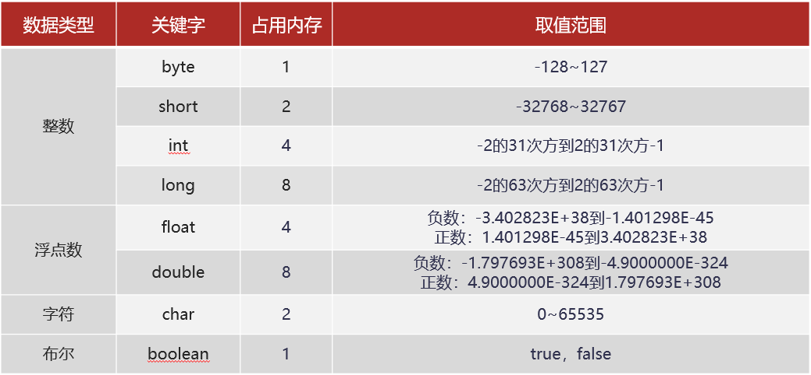

# IDEA教程

这里就涉及创建项目。

## 项目创建流程

### 创建项目

1. 首先新建项目》空项目》填写名称》点击创建。


2. 点击文件》选择项目结构》选择项目》配置sdk》设置17>语言级别比17低就可以，这里我截图截错了。


3. 打开模块》点击加号》新建模块》输入名称》点击创建


4. 创建完效果


### 创建软件包

软件包就类似于一个大包，比如要创建一个大项目，有支付接口、WEB界面等，那么可以针对这几个创建一个包，这里要按照一定的要求：

```
多个单词使用，首字母要大写
项目正常是公司域名去除www来创建项目，然后域名反写
```

1. 右击SRC》创建软件包》输入：com.day01》这里相当于创建两个包，父包为com，子包为day01。


2. 创建后效果


### 创建程序

这里的创建程序，确实就是创建类。

1. 右击day01》创建java类》输入一个名字（英文最好）


### 项目测试

这个程序测试过关后，那么IDEA就正式能够运行了。

```java
package com.day01;

public class one {
    public static void main(String[] args) {
        System.out.println("你好!");
    }
}
```


## IDEA中基本配置&注释

刚才我在讲解代码的过程中，有同学可能觉得看的不是很清楚，那下面呢，我们就来对IDEA进行两个基本的设置：

### 修改背景主题为白色


### 修改字体大小

按照1,2,3,4进行设置即可


至于其他的设置，后面我们用到的时候再去讲解。

### 注释

讲解完IDEA的这两个基本设置后，下面，我们说一下注释，那什么是注释呢？

- 注释是指在程序中添加的说明性信息
- 注释不参与程序运行，仅起到说明作用

这里我们再来介绍一下注释的分类：


了解了注释的作用和分类后，下面我们来对前面讲解过的HelloWorld案例添加注释：

```java
/*
    Java程序中最基本的组成单位是类

    类的定义格式是：
        public class 类名 {

        }
 */
public class HelloWorld {
    /*
        这是main方法
        main方法是程序的入口方法，代码的执行是从main方法开始的
     */
    public static void main(String[] args) {
        //这是输出语句，能够将""里面的内容输出到控制台，并且""里面的内容是可以修改的
        System.out.println("HelloWorld");
        System.out.println("Java");
    }
}
```

有了注释以后，我们再来看这段代码，明显就容易理解了。后面大家自己在编写代码的时候，也要多写写注释，在实际开发中，我们编写的程序也是要添加注释的。

这样既方便自己阅读，也方便别人阅读。

### IDEA中常用快捷键

为了提高我们后续写程序的效率，这里呢，我们来讲一些IDEA中常用的快捷键：

- 快速生成main方法和输出语句
  - main方法：main或者psvm，回车
  - 输出语句：sout，回车

- 常用快捷键
  - Ctrl+D：复制数据到下一行
  - Ctrl+X：剪切数据，可以用来删除所在行
  - Ctrl+Alt+L：格式化代码，建议自己写代码的时候就注意格式
  - Ctrl+/：对选中的代码添加单行注释，如果想取消注释，再来一次即可
  - Ctrl+Shift+/：对选中的代码添加多行注释，如果想取消注释，再来一次即可

根据老师的讲解，大家练习一下常用的快捷键吧。

###  IDEA中模块操作

IDEA的基本使用我们掌握了，最后呢，我们再来说一下，IDEA中的模块操作，而关于模块操作呢，分为三种：

- 新建模块
- 删除模块
- 导入模块

下面我们分别来操作一下。

**新建模块：**HelloWorld案例中讲解过了，这里就不再讲解了，想不起来了，翻到上面去看看

**删除模块：**删除模块又分为从工作区删除和从硬盘删除，你可以根据自己的需要，选择对应的方式进行删除


**导入模块：**

建议把模块复制到空项目所在路径下，然后找到新建模块的地方，只不过这一次不是新建模块，而是导入模块，所以，要选择Import Module


找到要导入的模块，点击OK


然后一路next，直到出现如下的界面，点击Overwrite即可


看到下面的界面，点击Finish


最后点击OK即可


这样我们就成功的导入了一个模块：


导入模块的注意事项：

- 把模块复制到空项目所在路径下
- 出现如下错误，知道如何处理


到此，关于IDEA的模块操作我们就讲完了。

# 基础语法

下面呢，我们来学习Java基础语法部分的知识，这些内容是我们后面编写程序的基本功，所以呢，大家得好好学习，下面我们说一下这一块的课程安排：


至于这5个小知识，我们该怎么用，下面呢，我们分别来讲解，首先，我们学习字面量。

## 字面量

那什么是字面量呢？

- 直接写出来的人可以理解的数据，在java中叫做字面量
- 举例：“HelloWorld”，666，13.14

那Java中有哪些类型的字面量呢？


知道了Java中的字面量后，下面我们到IDEA中去演示一下字面量的使用：

```java
/*
        字符串字面量：	    用双引号括起来的内容。"HelloWorld","黑马程序员"
		整数字面量：		不带小数的数字。666,-88
		小数字面量：		带小数的数字。13.14,-5.21
		字符字面量：		用单引号括起来的内容。'A','0','我'
		布尔字面量：		布尔值，表示真假。true,false
 */
public class LiteralDemo {
    public static void main(String[] args) {
        //字符串字面量
        System.out.println("HelloWorld");
        System.out.println("黑马程序员");

        //整数字面量
        System.out.println(666);
        System.out.println(-88);

        //小数字面量
        System.out.println(13.14);
        System.out.println(-5.21);

        //字符字面量
        System.out.println('A');
        System.out.println('0');
        System.out.println('我');

        //布尔字面量
        System.out.println(true);
        System.out.println(false);
    }
}
```

讲解完毕之后，大家赶快动手练习一下吧。

### 数据类型

刚才我们学习了字面量，而Java是一种强类型语言，针对每种数据都给出了明确的数据类型，那我们刚才学习的几种字面量分别应该是什么类型的呢？


那为什么会有不同的数据类型呢？因为

- 不同的数据类型分配了不同的内存空间
- 不同的内存空间，所存储的数据大小是不一样的

在讲解不同的数据类型前，这里我们先普及一个小知识，就是字节的概念：

计算机中存储数据的最小单位是：字节(byte)，用B表示。

我们可以看一下硬盘存储的文件：以字节为单位


为了帮助大家更好的理解字节这个单位，我们来说一下，常见的存储单位：

1TB = 1024GB

1GB = 1024MB

1MB = 1024KB

1KB = 1024B

这样呢，我们对字节就能有一个基础认知。有了一个基础的认知之后，我们再来说Java中的数据类型


今天我们重点学习的是基本数据类型，关于引用数据类型，后面我们会重点学习。

在这里，我们给出每种基本数据类型的内存占用和取值范围，大家了解一下：



<font color='red'>**说明：**</font>E+38表示：乘以10的38次方。同理E-45表示：乘以10的负45次方

整数默认是：int类型

浮点数默认是：double类型

这样呢，我们就了解了Java中的8种基本数据类型，以及每种数据类型占用字节的情况和取值范围。关于数据类型，我们就先讲到这里。

## 变量

学完后数据类型后，下面呢，我们来学习Java中非常重要的一个知识：变量。

那为什么要有变量呢？看这里，我们写了一段代码，在控制台显示商品的促销活动：


结果，老板觉得，这个价格有点高，怕销售不好，所以决定再降100元，要求把所有的998的地方修改为888。于是你就开始改代码，改完之后如下：


结果呢？老板又觉得不划算，让你还是改回998吧，这个时候，你就要哭了。还好要修改的地方不多，要是有很多地方都要进行类似的操作，那多麻烦啊，有没有简化的方式呢？

答案当然是有的，我们找一个空间存储数据：888，并给它起个名字：price


这样我们的代码就可以写成这个样子：


如果要修改price里面的数据，我们只需要修改一处就可以了，代码不需要改动，但是却实现了任意修改price的效果。


其实，这就是Java中的变量技术。有了它之后，我们就可以把变化的数据用一个变量存储，代码正常编写即可，如果需要修改数据，我们修改变量的值就可以了。那什么是变量呢？

- 变量就是内存中的存储空间
- 空间中存储的数据是可以发生改变

知道了，什么是变量后，下面我们来说一下变量的定义格式：

- 格式：数据类型 变量名 = 变量值;

- 范例：int price = 998;

  根据变量名进行使用，可以输出，也可以修改值


了解了变量的定义格式和使用方式后，下面我们到IDEA中去演示一下：

```java
/*
    格式：数据类型 变量名 = 变量值;
 */
public class VariableDemo01 {
    public static void main(String[] args) {
        //定义一个int类型的变量，用来表示价格
        int price = 998;

        //输出变量
        System.out.println(price);

        //修改变量的值
        price = 888;

        //再次输出变量的值
        System.out.println(price);
    }
}
```

学完了变量的定义，输出使用和修改值使用后，大家赶快动手练习一下吧。

### 变量的案例

了解了变量的定义和基本使用后，下面我们来做两个案例，熟悉一下变量的使用：

#### 手机信息描述

需求：分析下图指定数据，看看哪些可以通过变量表示，并思考采用那种数据类型，最后通过程序实现

指定数据：京东价，重量，颜色


分析：

① 京东价，重量，选择颜色这些字都是固定的，但是他们后面的数据是变化的，所以要用变量表示

② 价格，可以用double或者int类型来表示，这里我们用int类型表示；

​     重量，用double类型表示；颜色，用String类型表示

分析完毕之后，下面我们到IDEA中去实现一下：

```java
/*
    手机信息描述
 */
public class VariableTest01 {
    public static void main(String[] args) {
        //定义秒杀价变量
        double price = 3599.00;

        //定义颜色变量
        String color = "蓝色";

        //定义版本变量，纪录的是内存大小
        int size = 8;

//        System.out.println(price);
//        System.out.println(color);
//        System.out.println(size);

        //为了输出效果好看一些，我加上一些内容
        System.out.println("秒杀价是："+price);
        System.out.println("你选择的颜色是："+color);
        System.out.println("你选择的版本是："+size);

        //字符串字面值+任意的数据=字符串数据
    }
}
```

讲解完毕后，大家赶快动手练习一下吧。

#### 疫情防控信息采集表

需求：分析右图信息，并通过程序实现


通过上图数据，我们可以根据变化的数据，提取出下图：


分析：

① String name = “风清扬”;

② int age = 36;

③ char gender = ‘男’;  也可以采用String类型表示

④ double temperature = 36.2;

⑤ boolean flag = true; 也可以采用char或者String表示

分析完毕之后，下面我们到IDEA中去实现一下：

```java
/*
    疫情防控信息采集表
 */
public class VariableTest02 {
    public static void main(String[] args) {
        //定义变量
        String name = "风清扬";
        int age = 18;
        char gender = '男';
        double temperature = 36.2;
        boolean flag = true;

        //输出数据
        System.out.println("姓名是：" + name);
        System.out.println("年龄是：" + age);
        System.out.println("性别是：" + gender);
        System.out.println("体温是：" + temperature);
        System.out.println("是否接种过疫苗：" + flag);
    }
}
```

讲解完毕后，大家赶快动手练习一下吧。

### 变量的注意事项

关于变量的使用呢，我们讲解几个小的注意事项，大家了解一下，这样呢，遇到变量的问题后，大家就可以知道如何解决了。

变量的注意事项：

- 变量名不能重复
- 变量未赋值，不能使用
- 定义long类型变量，数据后面加L
- 定义float类型变量，数据后面加F

IDEA中代码演示如下：

```java
/*
    变量使用的注意事项
 */
public class VariableDemo02 {
    public static void main(String[] args) {
        int age = 10;
//        int age = 20;

//        int money;
////        money = 20;
//        System.out.println(money);

        long money = 1000000000000L;
        float price = 12.34F;
    }
}
```

讲解完毕后，大家赶快动手练习一下吧。

### 关键字

下面我们来学习一个小的知识点：关键字。

首先，我们得知道什么是关键字：

**关键字：**就是被Java语言赋予了特定含义的单词

我们先来看一下，曾经写过的代码中，出现的关键字：


了解了什么是关键字后，我们来说一下**关键字的特点**：

- 关键字的字母全部小写
- 常用的代码编辑器，针对关键字有特殊的颜色标记，非常直观

知道了关键字的特点后，这里我们给大家看看Java中的关键字：


虽然比较多，但是大家不用担心。因为：关键字，我们不需要专门记忆。这些关键字我们在开发中比较常用的，写的多了，你自然就记住了。好了，Java中的关键字我们就先讲到这里。

### 标识符

下面呢，我们来讲解基础语法部分最后一个知识：标识符。

首先，我们来说一下什么是标识符：

**标识符：**就是给类，方法，变量等起名字的符号

比如，我们前面写类的时候，起的名字：HelloWorld，变量的时候，价格，price等，这就是标识符。


那这个符号你能随便写呢，当然是不能的，这里我们来看一下**标识符的组成规则**：由数字、字母、下划线(_)和美元符($)组成

了解了组成规则后，这里我们还得说一下**注意事项：**

- 不能以数字开头
- 不能是关键字
- 区分大小写

判断下面哪些标识符不符合规则

bj  b2  2b  _2b  class  helloworld

按照我们讲解的规则，大家应该能够判断出来：2b和class是不符合规则的。


知道了标识符的组成规则和注意事项后，这里我们再说一下起名字常用的**命名约定：**

- 小驼峰命名法
  - 约定1：标识符一个单词的时候，首字母小写
  - 范例1：name
  - 约定2：标识符是多个单词的时候，第一个单词首字母小写，其他单词首字母大写
  - 范例2：firstName
- 大驼峰命名法
  - 约定1：标识符一个单词的时候，首字母大写
  - 范例1：Hello
  - 约定2：标识符是多个单词的时候，每个单词首字母大写
  - 范例2：HelloWorld

一般来说，小驼峰命名法适用于对方法，变量等起名字。大驼峰命名法适用于对类，接口等起名字。

最后再强调一点，就是我们起名字，最好能够做到：**见名知意**

比如，我们前面讲解过的变量的案例中，我们起的名字就做到了见名知意。


## 导包数据

### 从键盘获取数据

通过 System.in 获取数据流，java.util.Scanner 工具将数据流转换为想要的数据。

流程：

```java
Scanner键盘对象：
	导包：import java.util.Scanner;
	提示语句：System.out.println("请输入数据：");
	创建对象： Scanner sc = new Scanner(System.in);
	接受对象：int name = sc.nextInt();
```

案例：

```java
package com.day01;

import java.util.Scanner;

public class day_01 {
    public static void main(String[] args) {
        System.out.println("请输入数据：");
        Scanner sc = new Scanner(System.in);
        int name = sc.nextInt();
        System.out.println(name);
    }
}

```

合并案例：可以将两行合并成一行。

```java
 int name = new Scanner(System.in).nextInt();
```


#### 注意事项

需要注意的是，调用了那种类型的方法，就必须输入这种类型的数据，否则可能会报转换错误异常 Exception in thread "main" java.util.InputMismatchException


#### 常用获取数据类型

```java
package com.day01;

import java.util.Scanner;

public class day_01 {
    public static void main(String[] args) {
        System.out.println("请输入数据：");
        Scanner sc = new Scanner(System.in);
        //返回int型
        int nextInt = sc.nextInt();
        System.out.println("你输入的是： " + nextInt);
        //返回double型
        double nextDouble = sc.nextDouble();
        System.out.println("你输入的是： " + nextDouble);
        //返回一串字符串
        String nextLine = sc.nextLine();
        System.out.println("你输入的是： " + nextLine);
    }
}

```

### 随机数

流程：

```java
Random随机数对象：
	导包：import java.util.Random;
	创建对象：Random r = new Random();
	接受对象：int name = r.nextInt(10); //（0-指定值）
```

案例：

```java
package com.day01;


import java.util.Random;

public class day_01 {
    public static void main(String[] args) {
        //导包
        Random r = new Random();
        //接收数据
        int num = r.nextInt(10);
        System.out.println(num);
    }
}

```

合并案例：这里可以将接收数据和赋值数据直接合并

```java
 int num = new Random().nextInt(10);
```


#### 案例

输出10个1到10直接的随机数字。

```java
package com.day01;


import java.util.Random;

public class day_01 {
    public static void main(String[] args) {
        //导包
        Random r = new Random();
        for (int i = 0; i < 10; i++) {
            //接收数据
            int num = r.nextInt(10);
            System.out.println(num);
        }

    }
}


```

