# 运算符&选择语句

**今日目标：**

- 能够知道每种运算符的作用及使用特点
- 能够理解+操作的三种情况
- 能够知道顺序结构语句的执行流程
- 能够使用Debug查看程序的执行流程
- 能够根据需求选择合适的if语句实现
- 能够知道switch语句执行流程和注意事项

## 运算符

前面我们学过了通过字面量和变量来表示一个数据，这里呢，我们来学习对数据进行运算。而对数据运算就要用到我们这里要讲解的运算符，而在讲解具体的运算符之前，我们对运算符和表达式做一个简单的描述：

**运算符：**对字面量或者变量进行操作的<font color='red'>**符号**</font>

**表达式：**用<font color='red'>**运算符**</font>把字面量或者变量连接起来<font color='red'>**符合java语法的式子**</font>就可以称为表达式。不同运算符连接的表达式体现的是不同类型的表达式。

举例说明：**

int a = 10;

int b = 20;

int c = a + b;

<font color='red'>**+**</font>      ：是<font color='red'>**运算符**</font>，是算术运算符

<font color='red'>**a + b**</font>：是<font color='red'>**表达式**</font>，由于+是算术运算符，所以这个表达式叫算术表达式

知道了什么是运算符和表达式以后，我们来说一下这一块的课程安排：


总共要学习5种类型的运算符，后三种标记为灰色了，我们是在哪里用就在哪里学习。这里我们先学习前两种，首先我们来学习算术运算符

### 算术运算符

Java中的算术运算符有如下几种：

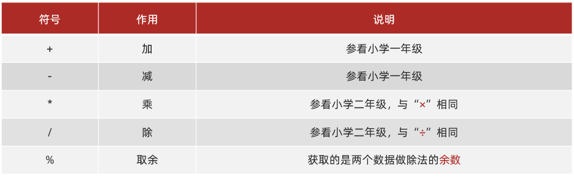

了解了Java中的算术运算符之后，下面我们到IDEA中去使用一下：

```java
/*
    算术运算符
 */
public class OperatorDemo {
    public static void main(String[] args) {
        //定义两个int类型的变量
        int a = 6;
        int b = 4;

        System.out.println(a + b);//10
        System.out.println(a - b);//2
        System.out.println(a * b);//24
        System.out.println(a / b);//1.5? 1
        System.out.println(a % b);//2

        //整数相除只能得到整数，要想得到小数，必须有浮点数的参与
        System.out.println(6.0 / 4);
    }
}

```

最后，我们来总结一下，刚才在演示代码的时候有两个注意事项：

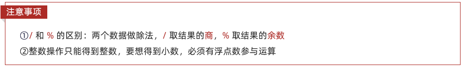	

讲解完毕后，大家赶快动手练习一下吧。

### 案例数值拆分

需求：定义一个三位数，将其拆分为个位、十位、百位后，输出在控制台

什么意思呢？下面我们举例来说明一下：

举例：int number = 123；

在控制台输出结果：

​	个位是：3

​	十位是：2

​	百位是：1

知道了要做什么后，下面我们来分析一下如何获取个位，十位，百位：

分析：

① 个位的计算：数值 % 10

​	123 除以 10（商12，余数为3）

② 十位的计算：数值 / 10 % 10

​	123 除以 10 （商12，余数为3，整数相除只能得到整数）

​	12 除以 10 （商1，余数为2）

③ 百位的计算：数值 / 10 / 10 % 10

​	123 / 10 / 10 % 10（123 / 10 得到12，12  / 10 得到1，1 % 10 得到 1）

分析完毕之后，下面我们到IDEA中去实现一下：

```java
/*
    需求：定义一个三位数，将其拆分为个位、十位、百位后，输出在控制台
 */
public class OperatorTest {
    public static void main(String[] args) {
        //定义一个三位数
        int number = 123;

        //获取个，十，百位数据
        int ge = number % 10;
        int shi = number / 10 % 10;
        int bai = number / 100 % 10;

        //输出结果
        System.out.println("个位是：" + ge);
        System.out.println("十位是：" + shi);
        System.out.println("百位是：" + bai);
    }
}
```

讲解完毕后，大家赶快动手练习一下吧。

### +操作的三种情况

#### 数字相加(类型转换)

在Java程序中，数据参与运算，要求类型一致。这里就涉及到了数据的类型转换。而类型转换又分为两种：

1. 隐式转换
2. 强制转换

**隐式转换：**把一个表示数据范围小的数值或者变量赋值给另一个表示数据范围大的变量

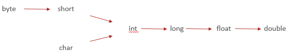

**强制转换：**把一个表示数据范围大的数值或者变量赋值给另一个表示数据范围小的变量

格式：数据类型 变量名 = (目标数据类型)(数值或者变量)


IDEA中代码演示如下：

```java
/*
    数字相加
 */
public class OperatorDemo01 {
    public static void main(String[] args) {
        int a = 10;
        double b = 13.14;
        System.out.println(a + b);

        int c = (int)(a + b);
        System.out.println(c);
//        double d = a + b;

        short s = 10;
        int i = 20;
        int j = s + i;
//        short ss = s + i;

        short ss = (short) (s + i);
    }
}
```

讲解完毕后，大家赶快动手练习一下吧。

#### 字符相加

来，继续啊，这里我们再来说一下字符参与+操作。

先到IDEA中去讲解，然后再回来总结。

IDEA中代码演示如下：

```java
/*
    字符相加
 */
public class OperatorDemo02 {
    public static void main(String[] args) {
        //定义两个变量
        int i = 10;
        char ch = 'A';//'A'的值是65
        ch = 'a';//'a'的值是97
        ch = '0';//'0'的值是48
        System.out.println(i + ch);
    }
}
```

代码演示完毕后，回到资料总结：

字符参与+操作，其实就是拿字符在计算机底层对应的数值来进行计算的，这里我们了解一下英文大小写字符和数字字符对应的数据值：

- ‘A’  65  A-Z是连续的
- ‘a’  97  a-z是连续的
- ‘0’  48  0-9是连续的

这里也给大家准备了一张ASCII码表，里面有常用的字符及其对应的数值关系：

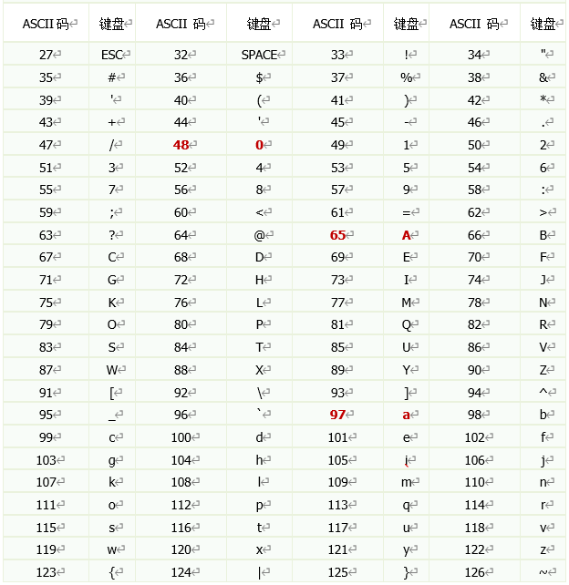

####  字符串相加

接下来，我们继续讲解字符串相加，先到IDEA中去讲解，然后再回来总结。

IDEA中代码演示如下：

```java
/*
    字符串相加
 */
public class OperatorDemo03 {
    public static void main(String[] args) {
        System.out.println("it" + "heima");
        System.out.println("itheima" + 666);
        System.out.println(666 + "itheima");

        System.out.println("itheima" + 6 + 66);
        System.out.println(1 + 99 + "年itheima");
    }
}

```

代码演示完毕后，回到资料总结：

- 当“+”操作中出现字符串时，这个“+”是字符串连接符，而不是算术运算
  - “zhongguo”+ 666
- 当连续进行“+”操作时，从左到右逐个执行
  - 1 + 9999 + “岁zhongguo”

讲解完毕后，大家赶快动手练习一下吧。

### 赋值运算符

下面呢，我们来学习赋值运算符。

Java中的赋值运算符有如下几种：

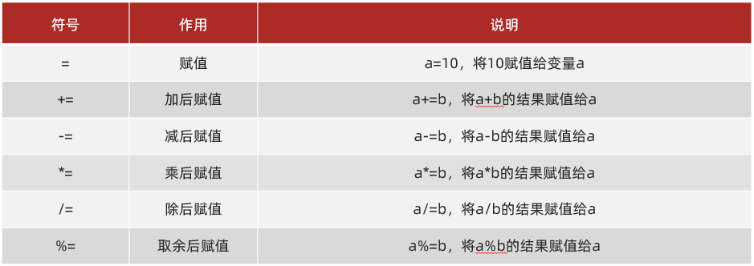

了解了Java中的赋值运算符之后，下面我们到IDEA中去使用一下：

```java
/*
    赋值运算符
 */
public class OperatorDemo {
    public static void main(String[] args) {
        int a = 10;
        System.out.println("a:" + a);

        // += : 把左边和右边的数据相加，最后把结果赋值给左边
//        a += 20;
        a = a + 20;
        System.out.println("a:" + a);


        //注意：扩展的赋值运算符底层隐含了强制类型转换
        short s = 1;
//        s += 2;
        s = (short) (s + 2);
        System.out.println("s:" + s);
    }
}
```

最后，我们来总结一下，刚才在演示代码的时候有个注意事项：

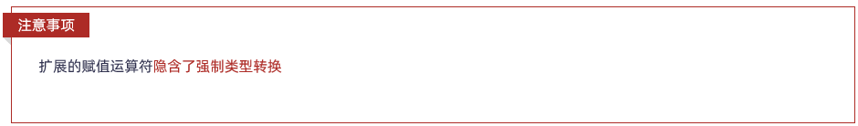

讲解完毕后，大家赶快动手练习一下吧。

## 选择语句

来，继续啊，为了控制程序的执行流程，Java 就提供了一些流程控制语句，我们先来举例说明一下：

**顺序结构：**从上往下，依次执行

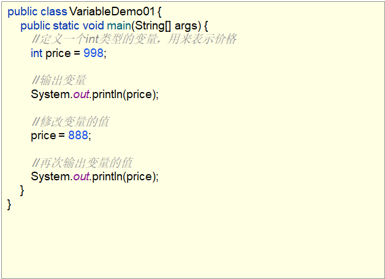

**选择结构：**

QQ界面的登录，填写账号和密码正确，展示好友列表界面。填写账号或者密码有误，提示：你输入的账号或密码不正确。

这就是通过选择结构来实现的，实际开发中，类似这种逻辑判断的情况非常常见。

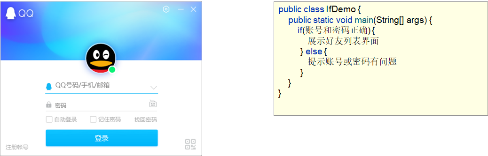

**循环结构：**

比如说，京东商城中，查询手机数据，京东就会返回给你一堆符合你查询要求的数据。

假如，每一部手机数据的展示需要5行代码，如果最终返回了1000部手机，你就需要编写5000行代码来实现数据展示。

这样就太麻烦了，那么，有没有一种流程语句，能够简化这种操作呢？答案肯定是有的，就是我们的循环结构，它就可以通过一个比较简单的结构来控制我们的手机展示1000次。

比如说，带着这样写就可以了，这就是循环结构。

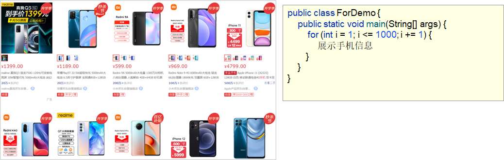

了解完毕之后，我们来说一下这一块的课程安排：


首先，我们来学习顺序结构

### 顺序结构

**顺序结构：**是程序中最简单最基本的流程控制，没有特定的语法结构，按照代码的先后顺序，依次执行

**执行流程图：**

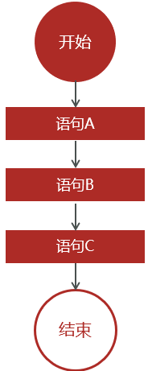

了解完顺序结构后，下面我们到IDEA中去演示一下：

```java
/*
    顺序结构语句
 */
public class OrderDemo {
    public static void main(String[] args) {
        System.out.println("开始");
        System.out.println("语句A");
        System.out.println("语句B");
        System.out.println("语句C");
        System.out.println("结束");
    }
}
```

这个比较简单，也没什么好练习的。就不练了，我们继续往下学习。

### Debug的基本使用

为了帮助大家更好的理解程序的执行流程，我们来学习Debug，那什么是Debug呢？

**Debug：**是供程序员使用的程序调试工具，它可以用于查看程序的执行流程，也可以用于追踪程序执行过程来调试程序

它的两大作用，查看程序执行流程，调试程序。由于目前我们每个程序的代码内容还比较少，

所以，今天重点掌握查看程序执行流程，当代码复杂的时候，我们需要通过debug来调试程序。那么，debug操作的流程是什么样子的呢？

在讲解操作流程前，我们来说一下：

Debug，又被称为<font color='red'>**断点调试**</font>，断点其实是一个标记，告诉我们从哪里开始查看

知道了Debug被称为断点调试后，我们来讲一下Debug的操作流程：

① 如何加断点

选择要设置断点的代码行，在行号的区域后面单击鼠标左键即可。如图

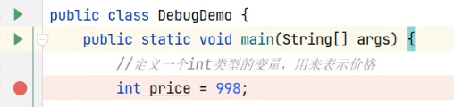

② 如何运行加了断点的程序

在代码区域右键Debug执行

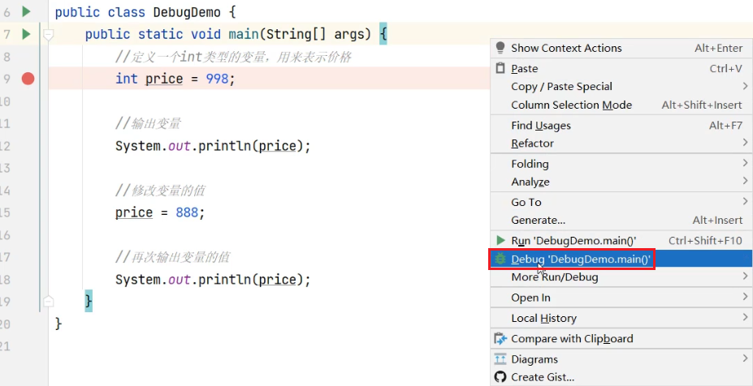

③ 看哪里

看Debugger窗口，看Console窗口

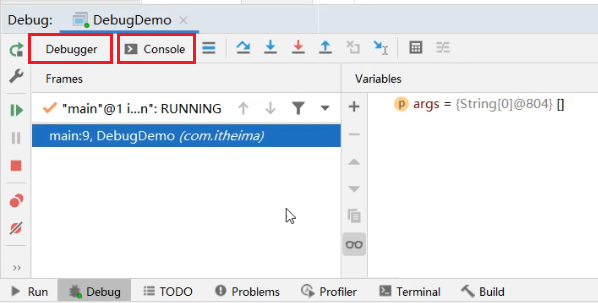

④ 点哪里

点(Step Over F8) 开始，点(Stop)结束

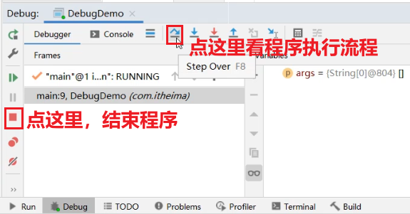

⑤ 如何删除断点

选择要删除的断点，单击鼠标左键即可。也就是把第一步的动作，再做一次即可。

总结一下，Debug的使用流程：

①如何加断点：选择要设置断点的代码行，在行号的区域后面单击鼠标左键即可

②如何运行加了断点的程序：在代码区域右键Debug执行

③看哪里：看Debugger窗口，看Console窗口

④点哪里：点(Step Over F8) 开始，点(Stop)结束

⑤如何删除断点：选择要删除的断点，单击鼠标左键即可

讲解完毕后，大家赶快动手练习一下吧。

通过Debug的方式看一下，如下代码的执行流程：

```java
/*
    Debug查看程序执行流程
 */
public class DebugDemo {
    public static void main(String[] args) {
        //定义一个int类型的变量，用来表示价格
        int price = 998;

        //输出变量
        System.out.println(price);

        //修改变量的值
        price = 888;

        //再次输出变量的值
        System.out.println(price);
    }
}
```

### 选择语句之if

选择语句有两种结构：

1. if语句
2. switch语句

这里我们先来学习if语句，它会根据判定的结果（真或假）决定执行某个分支的代码

举例说明一下：

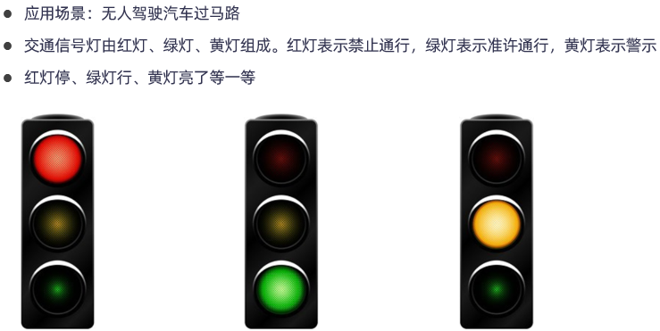

无人驾驶的核心就是需要编写大量的判断逻辑，让车辆的行驶变得更加安全。

了解了交通信号灯的基本逻辑后，下面呢，我们通过if语句来实现过马路的信号灯判断，而if语句呢，有三种格式，这里我们首先来学习第一种格式

#### if语句格式1

**格式：**

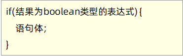

**范例：**

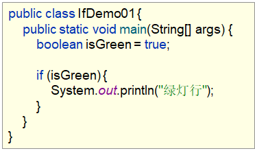

**执行流程：**

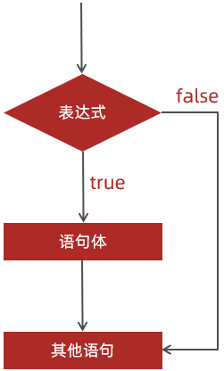

了解完if语句格式1之后，下面我们到IDEA中去使用一下：

```java
/*
    if语句格式1
 */
public class IfDemo01 {
    public static void main(String[] args) {
        //定义一个变量，用来表示绿灯的状态
        boolean isGreen = true;
        isGreen = false;

        if(isGreen) {
            System.out.println("绿灯行");
        }
    }
}
```

讲解完毕后，大家赶快动手练习一下吧。

#### if语句格式2和格式3

刚才我们通过if语句格式1进行了判断，是绿灯的时候，可以通行，但是不是绿灯的时候，没有告诉我不可以通行啊。所以，这里就产生了if语句的第二种格式，先在代码中演示，再回去总结：

```java
/*
    if语句格式2
 */
public class IfDemo02 {
    public static void main(String[] args) {
        //定义一个变量，用来表示绿灯的状态
        boolean isGreen = true;
        isGreen = false;

        if (isGreen) {
            System.out.println("绿灯行");
        } else {
            System.out.println("不是绿灯，不允许行使");
        }
    }
}
```

演示完毕后，我们来说一下，if语句格式2：

**格式：**

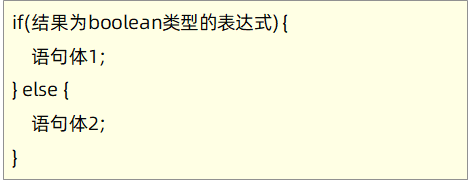

**范例：**

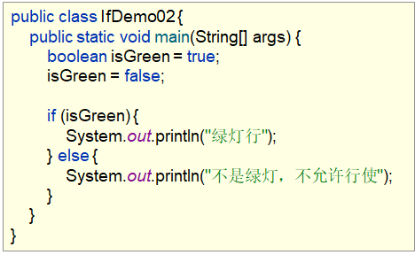

**执行流程：**

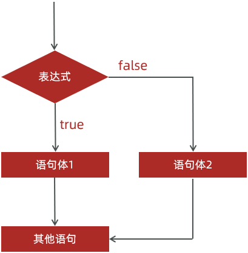

讲解完if语句格式2之后，我们到IDEA中再去看一段代码：

```java
public class IfDemo03 {
    public static void main(String[] args) {
        //定义三个变量，表示交通信号灯的三种状态
        boolean isRed = true;
        boolean isGreen = true;
        boolean isYellow = true;
        
        if (isRed) {
            System.out.println("红灯停");
        }

        if (isGreen) {
            System.out.println("绿灯行");
        }

        if (isYellow) {
            System.out.println("黄灯亮了等一等");
        }
    }
}
```

很明显，这是不合理的，因为我们把三种状态都设置为true了，而实际生活中，只会有一种状态为true，怎么解决呢多种情况的判断呢？这个时候就产生了if语句的第三种格式，先在代码中演示，再回去总结：

```java
/*
    if语句格式3
 */
public class IfDemo03 {
    public static void main(String[] args) {
        //定义三个变量，表示交通信号灯的三种状态
        boolean isRed = true;
        boolean isGreen = true;
        boolean isYellow = true;

        //红灯
//        isGreen = false;
//        isYellow = false;

        //绿灯
//        isRed = false;
//        isYellow = false;

        //黄灯
//        isRed = false;
//        isGreen = false;

        //出现了故障，信号灯都不亮了
        isRed = false;
        isGreen = false;
        isYellow = false;


        if(isRed) {
            System.out.println("红灯停");
        }else if(isGreen) {
            System.out.println("绿灯行");
        }else if(isYellow) {
            System.out.println("黄灯亮了等一等");
        } else  {
            System.out.println("交通信号灯故障，请在保证安全的情况下通行");
        }
    }
}
```

演示完毕后，我们来说一下，if语句格式3：

if语句格式3：

**格式：**

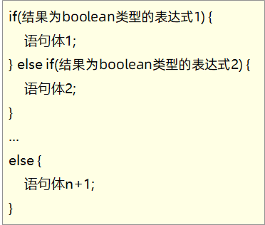

**执行流程：**

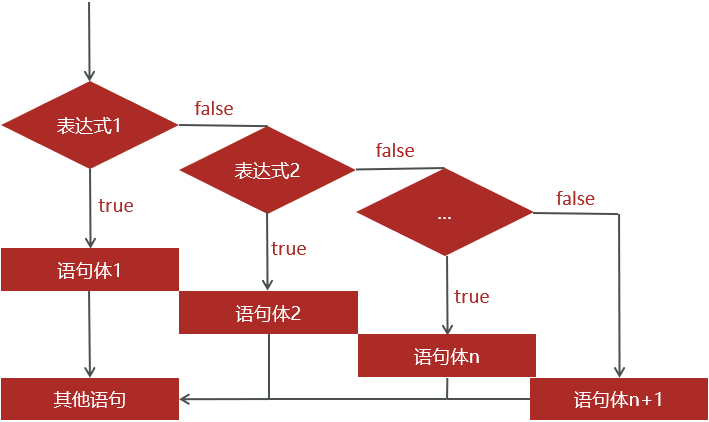

讲解完毕后，大家赶快动手练习一下吧。

#### 案例1(交通信号灯)

需求：交通信号灯由红灯、绿灯、黄灯组成，请通过程序实现不同的信号灯给出不同的提示。

提示信息：红灯停、绿灯行、黄灯亮了等一等


首先，我们来简单的分析一下：

**分析：**

① 用哪种类型来表示信号灯的三种状态呢？

用int类型来表示信号灯的三种状态(1表示红灯，2表示绿灯，3表示黄灯)

② 用if语句的哪种格式来实现该需求呢？

一般来说：1种情况的判断用if格式1,2种情况的判断用if格式2，多种情况的判断用if格式3

③ if语句判断的表达式该怎么写呢？

int light = 1;

if(light == 1) {…}

==：是关系运算符，用来判断两个数据是否相等，如果相等，结果为true，否则为false

分析完毕后，我们来说一下实现步骤：

**实现步骤：**

① 定义一个int类型的变量用来表示信号灯的状态(1表示红灯，2表示绿灯，3表示黄灯)

② 用if语句格式3进行多种情况的判断

③ 根据不同的情况给出不同的提示信息

知道了实现步骤，下面我们到IDEA中去实现一下：

```java
/*
    需求：交通信号灯由红灯、绿灯、黄灯组成，请通过程序实现不同的信号灯给出不同的提示。
    提示信息：红灯停、绿灯行、黄灯亮了等一等
 */
public class IfTest01 {
    public static void main(String[] args) {
        //1:定义一个int类型的变量用来表示信号灯的状态(1表示红灯，2表示绿灯，3表示黄灯)
        int light = 1;
        light = 2;
        light = 3;
        light = 4;

        //2:用if语句格式3进行多种情况的判断
        //3:根据不同的情况给出不同的提示信息
        if (light == 1) {
            System.out.println("红灯停");
        } else if (light == 2) {
            System.out.println("绿灯行");
        } else if (light == 3) {
            System.out.println("黄灯亮了等一等");
        } else {
            System.out.println("交通信号灯故障，请在保证安全的情况下通行");
        }
    }
}
```

讲解完毕后，大家赶快动手练习一下吧。

### 关系运算符

Java中的关系运算符有如下几种：

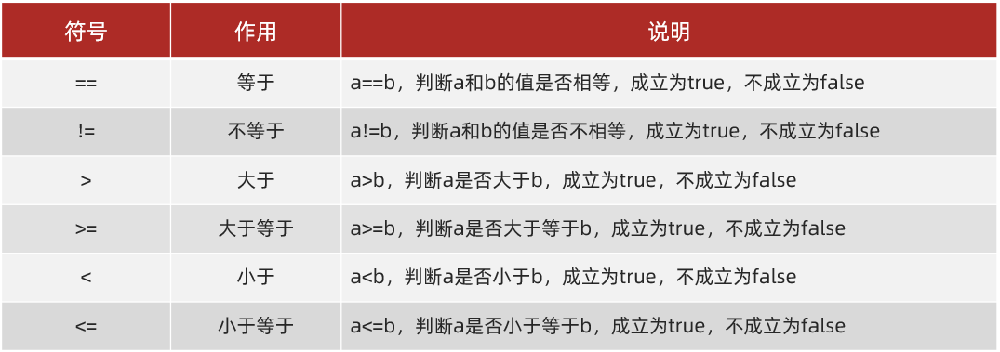

了解了Java中的关系运算符之后，下面我们到IDEA中去使用一下：

```java
/*
    关系运算符
 */
public class OperatorDemo01 {
    public static void main(String[] args) {
        //定义三个int类型的变量
        int i = 10;
        int j = 20;
        int k = 10;

        //等于：==
        System.out.println(i == j);//false
        System.out.println(i == k);//true
        System.out.println("--------");

        //不等于：!=
        System.out.println(i != j);//true
        System.out.println(i != k);//false
        System.out.println("--------");

        //大于：>
        System.out.println(i > j);//false
        System.out.println(i > k);//false
        System.out.println("--------");

        //大于等于：>=
        System.out.println(i >= j);//false
        System.out.println(i >= k);//true
        System.out.println("--------");

        //千万不要把==写成了=
        System.out.println(i = j); //20
    }
}
```

最后，我们来总结一下，刚才在演示代码的时候有两个注意事项：

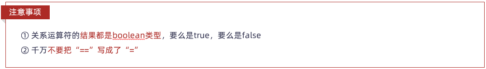

讲解完毕后，大家赶快动手练习一下吧。

#### 案例2(奇偶数)

需求：给定一个整数，请用程序实现判断该整数是奇数还是偶数，并在控制台输出该整数是奇数还是偶数

提示：偶数是能够被2整除的整数

首先，我们来简单的分析一下：

**分析：**

① 如何判断一个整数是奇数还是偶数？

整数对2进行取余，余数为0是偶数，否则为奇数

② 用if语句的哪种格式来实现该需求呢？

该整数要么是偶数，要么是奇数，2种情况，所以用if语句格式2

分析完毕后，我们来说一下实现步骤：

**实现步骤：**

① 定义一个int类型的整数

② 用if语句格式2进行判断

③ 根据是否是偶数给出不同的提示信息

知道了实现步骤，下面我们到IDEA中去实现一下：

```java
/*
    需求：给定一个整数，请用程序实现判断该整数是奇数还是偶数，并在控制台输出该整数是奇数还是偶数
 */
public class IfTest02 {
    public static void main(String[] args) {
        //1:定义一个int类型的整数
        int number = 10;
        number = 9;

        //2:用if语句格式2进行判断
        //3:根据是否是偶数给出不同的提示信息
        if (number % 2 == 0) {
            System.out.println(number + "是偶数");
        } else {
            System.out.println(number + "是奇数");
        }
        
    }
}
```

讲解完毕后，大家赶快动手练习一下吧。

#### 案例3(手机以旧换新)

需求：张三想买一台7988元的新手机，他的旧手机在二手市场能卖1500元，而手机专卖店推出以旧换新优惠，把他旧手机交给店家，新手机就能够打8折优惠。

为了更省钱，要不要以旧换新？请通过程序告诉张三

首先，我们来简单的分析一下：

**分析：**

① 计算不使用以旧换新的花费

7988 - 1500

② 计算使用以旧换新的花费

7988 * 0.8

③ 用if语句的哪种格式来实现该需求呢？

if语句格式2

分析完毕后，我们来说一下实现步骤：

**实现步骤：**

① 定义变量(money1)纪录不使用以旧换新的花费

② 定义变量(money2)纪录使用以旧换新的花费

③ 用if语句格式2进行判断 money1是否大于money2

④ 根据判断结果，给出相应的提示

知道了实现步骤，下面我们到IDEA中去实现一下：

```java
/*
    需求：张三想买一台7988元的新手机，他的旧手机在二手市场能卖1500元，而手机专卖店推出以旧换新优惠，
        把他的旧手机交给店家，新手机就能够打8折优惠。为了更省钱，要不要以旧换新？请通过程序告诉张三
 */
public class IfTest03 {
    public static void main(String[] args) {
        //1:定义变量(money1)纪录不使用以旧换新的花费
        int money1 = 7988 - 1500;

        //2:定义变量(money2)纪录使用以旧换新的花费
        double money2 = 7988 * 0.8;

        //3:用if语句格式2进行判断 money1是否大于money2
        //4:根据判断结果，给出相应的提示
        if (money1 > money2) {
            System.out.println("使用以旧换新更省钱");
        } else {
            System.out.println("不使用以旧换新更省钱");
        }
        
    }
}
```

讲解完毕后，大家赶快动手练习一下吧。

#### 案例4(你是青年人吗)

需求：给出你的年龄，通过程序判断你是否属于青年人？

提示：世界卫生组织，经过对全球人体素质和平均寿命进行测定，对年龄划分标准作出了新的规定


首先，我们来简单的分析一下：

**分析：**

① 如何判断一个年龄是否属于青年人？

年龄要大于等于18，并且小于等于65

② 在Java中如何表示并且的关系呢？

age >=18 && age<=65

**<font color='red'>&&</font>：是逻辑运算符，用来连接两个结果为boolean类型的表达式，都为true，结果为true，否则为false**

分析完毕后，我们来说一下实现步骤：

**实现步骤：**

① 定义一个int类型的变量来表示你的年龄

② 用if语句格式2进行判断看你是否属于青年人

③ 根据是否是青年人给出不同的提示信息

知道了实现步骤，下面我们到IDEA中去实现一下：

```java
/*
    需求：给出你的年龄，通过程序判断你是否属于青年人？
    提示：青年人的年龄范围 18~65
 */
public class IfTest04 {
    public static void main(String[] args) {
        //1:定义一个int类型的变量来表示你的年龄
        int age = 22;
        age = 100;

        //2:用if语句格式2进行判断看你是否属于青年人
        //3:根据是否是青年人给出不同的提示信息
        if(age>=18 && age<=65) {
            System.out.println("你是青年人");
        } else {
            System.out.println("你不是青年人");
        }
        
    }
}
```

讲解完毕后，大家赶快动手练习一下吧。

### 逻辑运算符

Java中常用的逻辑运算符有如下几种：

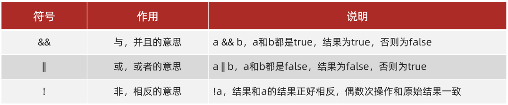

了解了Java中的逻辑运算符之后，下面我们到IDEA中去使用一下：

```java
/*
    逻辑运算符
 */
public class OperatorDemo02 {
    public static void main(String[] args) {
        //定义变量
        int i = 10;
        int j = 20;
        int k = 30;

        //逻辑与：&&
        System.out.println((i>j) && (i>k));//false && false
        System.out.println((i<j) && (i>k));//true && false
        System.out.println((i>j) && (i<k));//false && true
        System.out.println((i<j) && (i<k));//true && true
        System.out.println("-----------------------");

        //逻辑或：||
        System.out.println((i>j) || (i>k));//false || false
        System.out.println((i<j) || (i>k));//true || false
        System.out.println((i>j) || (i<k));//false || true
        System.out.println((i<j) || (i<k));//true || true
        System.out.println("-----------------------");

        //逻辑非：!
        System.out.println(!(i>j));//!false
        System.out.println(!!(i>j));//!!false
        System.out.println(!!!(i>j));//!!!false
        System.out.println(!!!!(i>j));//!!!!false
        
    }
}
```

讲解完毕后，大家赶快动手练习一下吧。

### 三元运算符

来，继续啊，下面我们来学习三元运算符：

**格式：**关系表达式 ？表达式1 ：表达式2；

**范例：**a > b ? a : b;

**执行流程：**

- 首先计算关系表达式的值

- 如果值为true，表达式1的值就是运算结果

  如果值为false，表达式2的值就是运算结果

了解了三元运算符的执行流程后，下面我们到IDEA中去使用一下：

```java
/*
    三元运算符
 */
public class OperatorDemo03 {
    public static void main(String[] args) {
        int a = 10;
        int b = 20;

        int max = a > b ? a : b;

        System.out.println("较大的值是：" + max);
    }
}
```

讲解完毕后，大家赶快动手练习一下吧。

#### 三元运算符和if语句格式2的区别

这里呢，我们来讲解一下三元运算符和if语句格式2的区别，它们有什么区别呢？我们先到IDEA中进行讲解，然后再回来总结：

```java
/*
    三元运算符和if语句格式2的区别
 */
public class OperatorTest {
    public static void main(String[] args) {
        //定义两个int类型的变量
        int a = 10;
        int b = 20;

        //需求：获取两个数中的较大值
        //if语句实现
//        int max;
//        if (a > b) {
//            max = a;
//        } else {
//            max = b;
//        }
//        System.out.println("较大的值是：" + max);

        if(a > b) {
            System.out.println("较大的值是：" + a);
        }else {
            System.out.println("较大的值是：" + b);
        }

        //三元运算符实现
        int max = a > b? a: b;
        System.out.println("较大的值是：" + max);
    }
}
```

讲解完毕之后，回来总结一下：

- 如果if语句控制的内容：是用变量纪录数据值，可以通过三元运算符改进

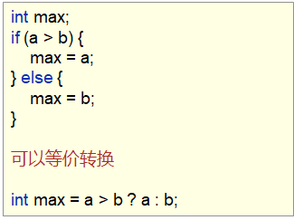

- 如果if语句控制的内容是：是通过输出语句直接输出数据值，无法通过三元运算符改进

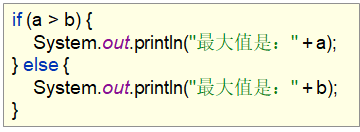

好了，关于三元运算符和if语句格式2的区别我们就讲到这里。这个知识大家先了解一下，方便我们后面在适合的场景选择合适的实现方案。

#### 三元运算多个数字计算

**格式：**（值=关系表达式 ？表达式1 ：表达式2） 关系表达式？值：表达式3；

**范例：**(max = (a > b ? a : b)) > c ? max : c;

**案例：**

```java
package com.lianxi;


public class day1 {
    public static void main(String[] args) {
        int max = bj(10, 20, 30);
        System.out.println(max);
    }

    public static int bj(int a, int b, int c) {
        int max = (max = (a > b ? a : b)) > c ? max : c;
        return max;
    }
}

```


### 选择语句之switch

来，继续啊，下面我们来学习选择语句中的switch语句。

**格式：**

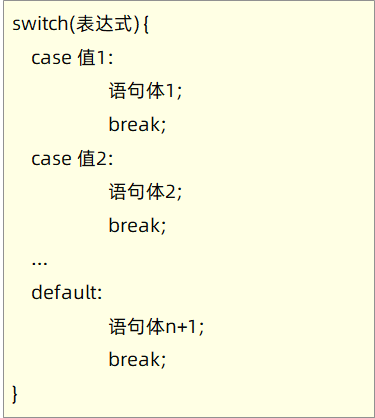

**格式说明：**

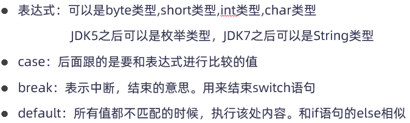

**执行流程：**

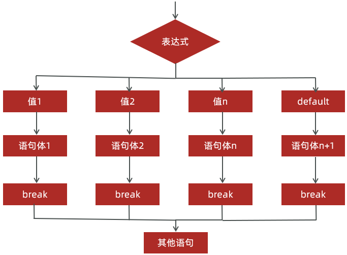

了解完switch语句后，下面我们到IDEA中去使用一下：

```java
/*
    switch语句
 */
public class SwitchDemo {
    public static void main(String[] args) {
        //定义一个int类型的变量用来表示信号灯的状态(1表示红灯，2表示绿灯，3表示黄灯)
        int light = 1;
//        light = 2;
//        light = 3;
//        light = 4;

        //用switch语句实现交通信号灯案例
        switch (light) {
            case 1:
                System.out.println("红灯停");
                break;
            case 2:
                System.out.println("绿灯行");
                break;
            case 3:
                System.out.println("黄灯亮了等一等");
                break;
            default:
                System.out.println("交通信号灯故障，请在保证安全的情况下通行");
                break;
        }

    }
}
```

最后，我们来总结一下，刚才在演示代码的时候有个注意事项：

**注意：**在switch语句中，如果case控制的语句体后面不写break，将出现穿透现象，在不判断下一个case值的情况下，向下运行，直到遇到break，或者整个switch语句结束