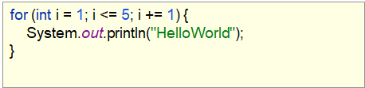
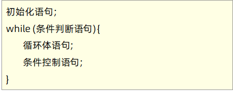

# 循环语句

**今日目标：**

- 能够理解循环语句的四个组成部分
- 能够知道三种循环的各自格式和执行流程
- 能够知道三种循环的区别
- 能够使用循环语句完成今日案例
- 能够知道跳转语句的使用场景

## for循环结构

来，继续啊，下面我们来学习循环结构语句，循环结构有三种语句，分别是：

1. for循环
2. while循环
3. do…while循环

这三种循环可以做相同的事情，当然它们也有小的区别，至于它们的应用及区别，我们后面会详细讲解。这里我们来学习for循环

### for循环结构

而在讲解for循环格式之前，我们先来看一下前面我们讲过的一个内容：这段代码的作用，是用来展示手机信息1000次。


还提到了这里的几个部分，分别是定义变量，条件判断，控制变量的变化，展示手机信息(可能被多次执行)

而for循环语句也是由这几部分组成。

**格式：**


**格式说明：**

- 初始化语句：这里可以是一条或者多条语句，这些语句用来完成初始化操作<font color='red'>**(int i=1)**</font>
- 条件判断语句：这里使用一个结果值为boolean类型的表达式，这个表达式能决定是否执行循环体语句<font color='red'>**(i<=1000)**</font>
- 循环体语句：这里可以是任意语句，这些语句可能被多次执行<font color='red'>**(展示手机信息)**</font>
- 条件控制语句：这里通常是使用一条语句来改变变量的值，从而达到控制循环是否继续向下执行的效果<font color='red'>**(i+=1)**</font>

**范例：**



**执行流程：**


知道了for循环的格式和执行流程后，下面我们到IDEA中去演示一下：

```java
/*
    for循环结构
 */
public class ForDemo {
    public static void main(String[] args) {
        for(int i=1; i<=5; i+=1) {
            System.out.println("HelloWorld");
        }
    }
}
```

代码演示后，通过Debug查看了一下程序的执行流程，让我们更清晰for循环的执行流程。

讲解完毕后，大家赶快动手练习一下吧。

### 案例1(输出数据)

需求：在控制台输出1-5的数据

首先，我们来简单的分析一下：

**分析：**

① 反复进行输出的动作，使用循环结构

② 从1开始到5结束，设置初始化从1开始

③ 从1开始到5结束，设置判断条件为没有到5的时候继续执行，执行到超过5程序结束

④ 从1到5，每次增加1，设置条件控制每次+1

⑤ 将反复进行的事情写入循环结构内部，打印对应数据

分析完毕之后，我们到IDEA中去实现一下：

```java
/*
    需求：在控制台输出1-5的数据
 */
public class ForTest01 {
    public static void main(String[] args) {
        System.out.println(1);
        System.out.println(2);
        System.out.println(3);
        System.out.println(4);
        System.out.println(5);
        System.out.println("--------------");

        for (int i = 1; i <= 5; i += 1) {
            System.out.println(i);
        }
        System.out.println("--------------");

        for (int i = 1; i <= 5; i += 2) {
            System.out.println(i);
        }
        System.out.println("--------------");

        //自增运算符：++
        //它跟在变量的后面表示变量的值+1
        for (int i = 1; i <= 5; i++) {
            System.out.println(i);
        }
        System.out.println("--------------");

        for (int i = 1; i <= 5; i++,i++) {
            System.out.println(i);
        }
        System.out.println("--------------");

        //我要获取数据5-1该怎么办呢？
        for (int i=5; i>=1; i-=1) {
            System.out.println(i);
        }
        System.out.println("--------------");

        for (int i=5; i>=1; i--) {
            System.out.println(i);
        }

    }
}
```

在讲解的过程中，我们还提出了自增运算符：++和自减运算符：--，并且演示了如何获取数据5-1。

讲解完毕后，大家赶快动手练习一下吧。

### 案例2(求和思想)

需求：求1-5之间的数据和，并把求和结果在控制台输出

首先，我们先到IDEA中去实现一下，然后再回来总结。

```java
/*
    需求：求1-5之间的数据和，并把求和结果在控制台输出
 */
public class ForTest02 {
    public static void main(String[] args) {
        //定义一个求和变量，用于保存求和的结果
        int sum = 0;

        //我们通过for循环实现获取数据1-5
        for (int i=1; i<=5; i++) {
            //i,1,2,3,4,5
//            sum = sum + i;
            sum += i;
            /*
                第一次求和：sum = sum + i = 0 + 1 = 1
                第二次求和：sum = sum + i = 1 + 2 = 3
                第三次求和：sum = sum + i = 3 + 3 = 6
                第四次求和：sum = sum + i = 6 + 4 = 10
                第五次求和：sum = sum + i = 10 + 5 = 15
             */
        }

        //输出结果
        System.out.println("1-5的求和结果是：" + sum);
    }
}
```

最后，我们来总结一下求和思想的实现步骤：

**实现步骤：**

① 求和的最终结果必须保存起来，需要定义一个变量，用于保存求和的结果，初始值为0

② 从1开始到5结束的数据，使用循环结构完成

③ 将反复进行的事情写入循环结构内部

​     此处反复进行的事情是将数据 i 加到用于保存最终求和的变量 sum 中

④ 当循环执行完毕时，将最终数据打印出来

讲解完毕后，大家赶快动手练习一下吧。

 ### 案例3(求偶数和)

需求：求1-100之间的偶数和，并把求和结果在控制台输出

首先，我们来简单的分析一下：

**分析：**

① 对1-100的数据求和与1-5的数据求和几乎完全一样，仅仅是结束条件不同

② 对1-100的偶数求和，需要对求和操作添加限制条件

③ 限制条件是偶数才参与运算，因此条件应该是判断是否是偶数

④ 当循环执行完毕时，将最终数据打印出来

分析完毕之后，我们到IDEA中去实现一下：

```java
/*
    需求：求1-100之间的偶数和，并把求和结果在控制台输出
 */
public class ForTest03 {
    public static void main(String[] args) {
        //1:求和的最终结果必须保存起来，需要定义一个变量，用于保存求和的结果，初始值为0
        int sum = 0;

        //2:对1-100的数据求和与1-5的数据求和几乎完全一样，仅仅是结束条件不同
        for (int i=1; i<=100; i++) {
            //3:对1-100的偶数求和，需要对求和操作添加限制条件，判断是否是偶数
            if(i % 2 == 0) {
                sum += i;
            }
        }

        //4:当循环执行完毕时，将最终数据打印出来
        System.out.println("1-100之间的偶数和是：" + sum);
    }
}
```

讲解完毕后，大家赶快动手练习一下吧。

 ### 案例4(水仙花数)

需求：在控制台输出所有的“水仙花数”

看到这个需求，我们首先要解决的问题就是，什么样的数据是“水仙花数”？它满足如下两个条件：

① 水仙花数是一个三位数

比如：111    222    333    370    371    520    999  

② 水仙花数的个位、十位、百位的数字立方和等于原数

比如：


知道了什么是水仙花数后，我们再来回顾一下如何获取一个数据的个位，十位，百位：

假设一个三位数为x，则

- 个位：x%10
- 十位：x/10%10
- 百位：x/100%10

了解了水仙花数相关的基础知识后，下面我们来说一下这个案例的实现步骤：

**实现步骤：**

① 获取三位数，通过循环实现

② 获取每一个三位数的个位，十位，百位

③ 判断该三位数是否是水仙花数

④ 输出水仙花数

知道了实现步骤，下面我们到IDEA中去实现一下：

```java
/*
    需求：在控制台输出所有的“水仙花数”
 */
public class ForTest04 {
    public static void main(String[] args) {
        //1:获取三位数，通过循环实现
//        for (int i=100; i<=999; i++) {
//
//        }

        for (int i = 100; i < 1000; i++) {
            //2:获取每一个三位数的个位，十位，百位
            int ge = i % 10;
            int shi = i / 10 % 10;
            int bai = i / 100 % 10;

            //3:判断该三位数是否是水仙花数
            if ((ge * ge * ge + shi * shi * shi + bai * bai * bai) == i) {
                //4:输出水仙花数
                System.out.println(i);
            }

        }

    }
}
```

讲解完毕后，大家赶快动手练习一下吧。

### 案例5(统计思想)

需求：统计“水仙花数”一共有多少个，并在控制台输出个数

首先，我们先到IDEA中去实现一下，然后再回来总结。

```java
/*
    需求：统计“水仙花数”一共有多少个，并在控制台输出个数
 */
public class ForTest05 {
    public static void main(String[] args) {
        //定义一个统计变量，用于数据的统计，初始化值为0
        int count = 0;

        for (int i = 100; i < 1000; i++) {
            int ge = i % 10;
            int shi = i / 10 % 10;
            int bai = i / 100 % 10;

            if ((ge * ge * ge + shi * shi * shi + bai * bai * bai) == i) {
//                System.out.println(i);
                //1,2,3,...
                count++;
            }
        }

        //输出水仙花的个数
        System.out.println("水仙花数一共有：" + count + "个");
    }
}
```

最后，我们来总结一下统计思想的实现步骤：

**实现步骤：**

① 定义统计变量count，初始化值为0

② 在判定水仙花数的过程中，满足条件不再输出，更改为修改count的值，使count+1

③ 输出统计变量的值

讲解完毕后，大家赶快动手练习一下吧。

### 案例6(回文数)

需求：输出所有五位数的回文数

看到这个需求，我们首先要解决的问题就是，什么样的数据是“回文数”？

那什么是“回文数”呢？一个数，无论是从左往右读,还是从右往左读，读起来都相同的数,叫做“回文数”

举例：

10101，12321：是回文数

12345：不是回文数

规律：

个位 = 万位

十位 = 千位

和百位无关

了解了回文数相关的基础知识后，我们来说一下这个案例的实现步骤：

**实现步骤：**

① 获取五位数，通过循环实现

② 获取每一个五位数的个位，十位，千位，万位

③ 判断该五位数是否是回文数

④ 输出回文数

知道了实现步骤，下面我们到IDEA中去实现一下：

```java
/*
    需求：输出所有五位数的回文数
 */
public class ForTest06 {
    public static void main(String[] args) {
        //1:获取五位数，通过循环实现
        for (int i = 10000; i < 100000; i++) {
            //2:获取每一个五位数的个位，十位，千位，万位
            int ge = i % 10;
            int shi = i / 10 % 10;
            int qian = i / 1000 % 10;
            int wan = i / 10000 % 10;

            //3:判断该五位数是否是回文数
            if ((ge == wan) && (shi == qian)) {
                //4:输出回文数
                System.out.println(i);
            }
        }

        //练习：统计五位数的回文数个数，并在控制台输出个数

    }
}
```

在案例的最后，我们留下了一个练习，大家记得完成哦。

讲解完毕后，大家赶快动手练习一下吧。

### 案例7(逢七过)

需求：朋友聚会的时候可能会玩一个游戏：逢七过。

规则是：从任意一个数字开始报数，当你要报的数字包含7或者是7的倍数时都要说：过。

为了帮助大家更好的玩这个游戏，这里我们直接在控制台打印出1-100之间的满足逢七必过规则的数据。

这样，大家将来在玩游戏的时候，就知道哪些数据要说：过。

首先，我们来简单的分析一下：

**分析：**

① 数据的范围1-100之间，用循环很容易实现

② 要满足的条件是：数字包含7(个位是7，或者十位是7)，或者是7的倍数

  	假如有一个数据：x
  	
  	判断个位为7：x%10 == 7
  	
  	判断十位为7：x/10%10 == 7
  	
  	判断是7的倍数：x%7 == 0

分析完毕后，我们来说一下实现步骤：

**实现步骤：**

① 获取1-100之间的数据，通过循环实现

② 判断数字包含7或者是7的倍数

  判断数据：要么个位是7，要么十位是7，要么能够被7整除

③ 在控制台输出满足条件的数据

知道了实现步骤，下面我们到IDEA中去实现一下：

```java
/*
    需求：朋友聚会的时候可能会玩一个游戏：逢七过。
 */
public class ForTest07 {
    public static void main(String[] args) {
        //1:获取1-100之间的数据，通过循环实现
        for (int i = 1; i <= 100; i++) {
            //2:判断数字包含7或者是7的倍数(判断数据：要么个位是7，要么十位是7，要么能够被7整除)
            if ((i % 10 == 7) || (i / 10 % 10 == 7) || (i % 7 == 0)) {
                //3:在控制台输出满足条件的数据
                System.out.println(i);
            }
        }

    }
}
```

讲解完毕后，大家赶快动手练习一下吧。

## while循环结构

### while循环结构

接下来，我们学习while循环结构语句

**格式：**



**范例：**


知道了while循环的格式后，下面我们到IDEA中去演示一下：

```java
/*
    while循环结构
 */
public class WhileDemo {
    public static void main(String[] args) {
        int i = 1;
        while (i<=5) {
            System.out.println("HelloWorld");
            i++;
        }
    }
}
```

代码演示后，通过Debug查看了一下程序的执行流程，让我们更清晰while循环的执行流程。

最后，我们再来总结一下while循环的执行流程：

**执行流程：**


讲解完毕后，大家赶快动手练习一下吧。

### 案例1(求奇数和)

需求：求1-100之间的奇数和，并把求和结果在控制台输出

首先，我们来简单的分析一下：

**分析：**

① 对1-100的奇数求和，和前面讲解的偶数求和几乎是完全一样，仅仅是判断条件不同

② 判断条件是奇数才参与运算，因此条件应该是判断是否是奇数

③ 当循环执行完毕时，将最终数据打印出来

分析完毕之后，我们到IDEA中去实现一下：

```java
/*
    需求：求1-100之间的奇数和，并把求和结果在控制台输出
 */
public class WhileTest01 {
    public static void main(String[] args) {
        //定义求和变量，初始化值为0
        int sum = 0;

        //获取1-100之间的数据
//        int i = 1;
//        while (i<=100) {
//            //判断数据是否是奇数
////            if(i%2 != 0) {
////                sum += i;
////            }
//
//            if(i%2 == 1) {
//                sum += i;
//            }
//
//            i++;
//        }

        int i = 1;
        while (i <= 100) {
            sum += i;
            i += 2; //1,3,5,7...99,101
        }

        //输出结果
        System.out.println("1-100之间的奇数和是：" + sum);
    }
}
```

讲解完毕后，大家赶快动手练习一下吧。

### 案例2(珠穆朗玛峰)

需求：世界最高峰珠穆朗玛峰(8848.86m)，我现在有一张足够大的纸张，厚度为：0.001m。请问，我折叠多少次，就可以保证厚度不低于珠穆朗玛峰的高度?

首先，我们来简单的分析一下：

**分析：**

① 因为要反复折叠，所以要使用循环，该选for循环还是while循环呢？

  	<font color='red'>**小技巧：循环次数明确，使用for循环；循环次数不明确，使用while循环**</font>
  	
  	这里不知道折叠多少次，这种情况下更适合使用while循环

② 纸张每折叠一次，厚度加倍，因此要先定义纸张厚度，在循环中使厚度加倍

③ 什么时候就停止折叠了呢？直到纸张的厚度大于等于珠峰的高度，反言之，就要折叠

④ 要求的是统计折叠次数，所以会用到统计思想 

分析完毕后，我们来说一下实现步骤：

**实现步骤：**

① 定义统计变量，初始化值为0

② 定义纸张厚度变量和珠峰高度变量

③ 用while循环实现反复折叠，判断条件是纸张厚度小于珠峰高度

④ 循环体中要做两件事情：一是纸张厚度加倍，二是统计变量+1

⑤ 当循环结束，输出统计变量的值

知道了实现步骤，下面我们到IDEA中去实现一下：

```java
/*
    需求：世界最高峰珠穆朗玛峰(8848.86m)，我现在有一张足够大的纸张，厚度为：0.001m。
         请问，我折叠多少次，就可以保证厚度不低于珠穆朗玛峰的高度?
 */
public class WhileTest02 {
    public static void main(String[] args) {
        //1:定义统计变量，初始化值为0
        int count = 0;

        //2:定义纸张厚度变量和珠峰高度变量
        double paper = 0.001;
        double zf = 8848.86;

        //3:用while循环实现反复折叠，判断条件是纸张厚度小于珠峰高度
        while (paper < zf) {
            //4:循环体中要做两件事情：一是纸张厚度加倍，二是统计变量+1
            paper *= 2;

            count++;
        }

        //5:当循环结束，输出统计变量的值
        System.out.println("要折叠" + count + "次");
    }
}
```

讲解完毕后，大家赶快动手练习一下吧。

## do-while循环结构

### do-while循环结构

接下来，我们学习do-while循环结构语句

**格式：**


**范例：**


知道了do-while循环的格式后，下面我们到IDEA中去演示一下：

```java
/*
    do...while循环结构
 */
public class DoWhileDemo {
    public static void main(String[] args) {
        int i = 1;
        do {
            System.out.println("HelloWorld");
            i++;
        } while (i<=5);
    }
}
```

代码演示后，通过Debug查看了一下程序的执行流程，让我们更清晰do-while循环的执行流程。

最后，我们再来总结一下do-while循环的执行流程：

**执行流程：**


讲解完毕后，大家赶快动手练习一下吧。

### 三种循环的区别

前面我们讲解了三种循环语句的格式和执行流程，下面我们来讲解这三种循环语句的区别。

而关于这三种循环语句的区别，我们先到IDEA中去讲解，然后再回来总结：

```java
/*
    三种循环的区别
 */
public class LoopTest {
    public static void main(String[] args) {
//        //for循环
//        for (int i = 3; i < 3; i++) {
//            System.out.println("我爱Java");
//        }
//        System.out.println("--------");
//
//        //while循环
//        int j = 3;
//        while (j < 3) {
//            System.out.println("我爱Java");
//            j++;
//        }
//        System.out.println("--------");
//
//        //do...while循环
//        int k = 3;
//        do {
//            System.out.println("我爱Java");
//            k++;
//        } while (k < 3);

//        //for循环
//        for (int i = 1; i < 3; i++) {
//            System.out.println("我爱Java");
//        }
////        System.out.println(i);
//        System.out.println("--------");
//
//        //while循环
//        int j = 1;
//        while (j < 3) {
//            System.out.println("我爱Java");
//            j++;
//        }
//        System.out.println(j);
//        System.out.println("--------");

        //死循环
//        for (;;) {
//            System.out.println("for...");
//        }

//        while (true) {
//            System.out.println("while...");
//        }

        do {
            System.out.println("do...while...");
        } while (true);

    }
}
```

讲解完毕后，回到资料，我们总结一下：

**三种循环语句的区别：** 

for循环和while循环<font color='red'>**先判断条件是否成立**</font>，然后决定是否执行循环体（先判断后执行）

do...while循环<font color='red'>**先执行一次循环体**</font>，然后判断条件是否成立，是否继续执行循环体（先执行后判断）


**for和while的区别：**

条件控制语句所控制的自增变量，在for循环结束后，就<font color='red'>**不可以继续使用**</font>了

条件控制语句所控制的自增变量，在while循环结束后，<font color='red'>**还可以继续使用**</font>


**死循环格式：**

for(;;){}

<font color='red'>**while(true) {}**</font>

do{}while(true);

由于循环语句的区别，只是大家需要理解的知识点，故这里不需要练习，我们在后面的使用中，在慢慢体会即可。

## continue和break

### continue和break

来，继续啊，下面我们来学习跳转控制语句，为了讲解跳转控制语句，这里我们给出几个场景看一看：

场景一：周一到周五上班，周六日不上班


场景二：成人后一直工作到60岁，60岁之后就可以退休养老了


刚才的场景中，重点介绍了两个跳转关键字：

- **continue**  	用在循环中，基于条件控制，跳过某次循环体内容的执行，继续下一次的执行
- **break**               用在循环中，基于条件控制，终止循环体内容的执行，也就是说结束当前的整个循环

了解了这两个跳转关键字之后，下面我们到IDEA中去体验一下：

```java
/*
   continue:用在循环中，基于条件控制，跳过某次循环体内容的执行，继续下一次的执行
   break:用在循环中，基于条件控制，终止循环体内容的执行，也就是说结束当前的整个循环
*/
public class ControlDemo {
    public static void main(String[] args) {
        for (int i = 1; i <= 5; i++) {
            if (i % 2 == 0) {
//                continue;
                break;
            }

            System.out.println(i);
        }
    }
}
```

讲解完毕后，大家赶快动手练习一下吧。

### 综合案例(小芳存钱)

需求：小芳的妈妈每天给她2.5元钱，她都会存起来，但是，每当这一天是存钱的第5天或者5的倍数的话，

她都会花去6元钱，请问，经过多少天，小芳才可以存到100元钱。

关于这个案例呢，我们到IDEA中一边分析，一边实现：

```java
/*
    需求：小芳的妈妈每天给她2.5元钱，她都会存起来，但是，每当这一天是存钱的第5天或者5的倍数的话，她都会花去6元钱，请问，经过多少天，小芳才可以存到100元钱。
*/
public class ControlTest {
    public static void main(String[] args) {
        //小芳的妈妈每天给她2.5元钱
        double dayMoney = 2.5;

        //她都会存起来，涉及到了求和思想，定义求和变量，初始化值为0
        double sumMoney = 0;

        //存到100元钱
        int result = 100;

        //定义一个统计变量，用来纪录存钱的天数，初始化值为1
        int dayCount = 1;

        //因为不知道要多少天才能够存到100元，所以，这里我们采用死循环来实现，当存到100元的时候，通过break跳转语句让循环结束
        while (true) {
            //存钱
            sumMoney += dayMoney;

            //判断存的钱是否大于等于100了，如果是，就退出循环
            if(sumMoney >= result) {
                break;
            }

            //每当这一天是存钱的第5天或者5的倍数的话，她都会花去6元钱
            if(dayCount%5 == 0) {
                sumMoney -= 6;
                System.out.println("第" + dayCount + "天花了6元");
            }

            dayCount++;
        }

        //输出统计天数的变量
        System.out.println("共花了" + dayCount + "天存了100元");
    }
}
```

讲解完毕后，大家赶快动手练习一下吧。

### 综合案例（猜数字）

猜数字小游戏:

使用Random随机数对象，生成一个[1-100]之间的整数，·作为正确答案·70

使用Scanner，提示用户录入猜的数据并接收，使用if语句判断用户猜的结果，打印对应提示

情况1:·猜的数超出了[1-100]的范围!请重新输入!

情况2∶·猜大了

情况3:·猜小了

情况4∶·恭喜你!猜对了

```java
package com.day01;


import java.util.Random;
import java.util.Scanner;

public class day_01 {
    public static void main(String[] args) {
        int num = new Random().nextInt(100) + 1;
        System.out.println("正确答案：" + num);
        int sum = 0;
        System.out.println("请输入一个1-100之间数字:");
        while (true) {
            int text = new Scanner(System.in).nextInt();
            if (text < 1 || text > 100) {
                System.out.println("你输入的数字超过控制值了，请重新输入:");
            } else if (text > num) {
                System.out.println("你输入的数字太大了,请重新输入:");
                sum++;
            } else if (text < num) {
                System.out.println("你输入的数字太小了,请重新输入:");
                sum++;
            } else {
                System.out.println("恭喜你猜对了！");
                sum++;
                break;
            }
        }
        System.out.println("本次共计输入" + sum + "次");

    }
}

```

