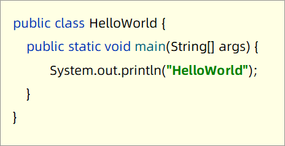
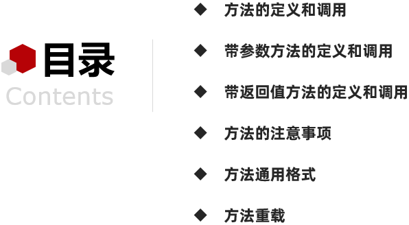

# 方法

**今日目标：**

- 能够知道方法的好处
- 能够根据两个明确分析方法的参数和返回值
- 能够编写方法完成授课案例，并在主方法中完成方法的调用
- 能够知道方法重载及其特点

## 方法的定义和使用

### 方法概述和课程安排

来，继续啊，下面我们来学习Java中很重要的一个知识，就是方法，那什么是方法呢？我们一起来说一下：

**方法(method)：**就是完成特定功能的代码块

如何理解这句话呢?来，我们看一段代码，相信这个大家应该已经很熟悉了

这就是我们的main方法，也就是我们说的主方法。它里面的代码的功能：是在控制台输出一个字符串数据：HelloWorld



我们再来看另一段代码：

这里出现了三个方法，主方法的作用，还是在控制台输出一个字符串数据：HelloWorld。而后面这两个方法的作用：分别是在控制台输出字符串数据：method1和method2


这些代码都是用一对大括号括起来的，所以我们说，方法就是完成特定功能的代码块。

知道了什么是方法后，我们来说一下为什么要学习方法，也就是方法的好处

看这里，植物大战僵尸这个游戏，估计有小伙伴玩过。


没玩过的，回去下载下来玩一下，我一直觉得玩游戏，对学编程是有帮助的，它能够打开我们的思维， 当然前提是适度的玩游戏，你天天玩，不好好学习，那肯定是不行的。

回到这里，我们继续，在这个游戏中，有这样的一些射手，它们通过发射炮弹去消灭僵尸

假如，现在我们来编写代码，实现发射炮弹的动作。

首先，我们来看豌豆射手要发射炮弹，而发射炮弹呢？需要20行代码实现。


这里代码我们就省略了啊，知道这个意思就行。

接着，寒冰射手要发射炮弹，我们还是要编写20行代码实现。


再接着，大头菜射手也要发射炮弹，我们还得再编写20行代码实现。


写到这里，我们发现太麻烦了，每个射手发射炮弹，我们都要写发射炮弹的代码。

而发射炮弹的代码是相同的，所以，目前我们的代码就出现问题了。

问题是：代码的重复度很高，复用性太差了。

那怎么解决呢？

看这里，关于这三个射手要发射炮弹的代码，我们不用针对每个射手都写，

而是把发射炮弹的代码打包，定义一个方法：叫做发射。

将来这三个射手要发射炮弹的时候，直接调用发射的方法就可以了。


而且，再加入一个新的射手，这个射手也要发射炮弹，我们也是直接调用发射的方法就可以了。


这样新的射手也可以发射炮弹了。

这样我们就减少了代码的编写，所以说，方法一个非常大的好处就是提高了代码的复用性。

了解了什么是方法，以及方法的好处后。我们来说一下方法这一块的课程安排：



首先，我们会讲解基本的方法的定义和调用

接着讲解带参方法和带返回值方法的定义和调用

方法的定义和调用完毕之后，讲解方法的注意事项，避免大家在定义方法时出现一些小问题。

注意事项讲解完毕之后，讲解方法的通用格式，给大家总结，其实方法就一种格式，

并非有上面那么多种方法格式，上面之所以这样讲解，是想通过循序渐进的方式，让大家更好的掌握方法的定义和使用

在方法通用格式这一块，还会重点讲解如何设计方法，并通过多个练习来强化方法的定义和使用，

只要大家能够跟着完成这些练习，方法我们基本上就算掌握了。

最后，我们会讲解方法中一个重要的特性：方法重载。

好了，到此关于方法的概述和课程安排我们就先讲到这里

### 方法的定义和调用

下面呢我们来学习方法的定义和调用。

**格式：**


**范例：**


知道了方法的定义格式后，我们到IDEA中去演示一下：

```java
/*
    定义格式：
        public static void 方法名() {
           //方法体
       }
 */
public class MethodDemo {
    public static void main(String[] args) {
        //调用方法
        isEvenNumber();
    }

    //需求：定义一个方法，在方法中定义一个变量，判断该数据是否是偶数
    public static void isEvenNumber() {
        //在方法中定义一个变量
        int number = 10;
        number = 9;

        //判断该数据是否是偶数
        if (number % 2 == 0) {
            System.out.println(number + "是偶数");
        } else {
            System.out.println(number + "不是偶数");
        }
    }
}
```

演示完毕之后，回到资料我们总结一下方法的调用和注意事项：

**格式：**


**范例：**


**注意事项：**

- 方法定义完毕后，<font color='red'>**需要调用才能执行**</font>
- 方法必须<font color='red'>**先定义后调用**</font>，否则程序将报错
- 方法和方法之间的关系是平级的。 

讲解完毕后，大家赶快动手练习一下吧。

### Debug查看方法调用

按照 Debug 的正常使用即可，但是要注意如下事项：

- 进入一个方法的时候，需要用 Step Into F7
- 在方法内部，看每一行代码的执行流程，使用 Step Over F8
- 注意观察方法的出现和消失，以及变量的变化 

#### 练习1(输出较大值)

需求：设计一个方法用于打印两个数中的较大数

首先，我们来简单的分析一下：

**分析：**

① 定义一个方法，用于打印两个数字中的较大数，例如：getMax()

② 方法中定义两个变量，用于保存两个数字

③ 使用if语句对两个数字的大小关系进行处理

④ 在main()方法中调用定义好的方法

分析完毕之后，我们到IDEA中去实现一下：

```java
/*
    需求：设计一个方法用于打印两个数中的较大数

    分析：
        1:定义一个方法，用于打印两个数字中的较大数，例如：getMax()
        2:方法中定义两个变量，用于保存两个数字
        3:使用if语句对两个数字的大小关系进行处理
        4:在main()方法中调用定义好的方法
 */
public class MethodTest {
    public static void main(String[] args) {
        //在main()方法中调用定义好的方法
        getMax();
    }

    //定义一个方法，用于打印两个数字中的较大数，例如：getMax()
    public static void getMax() {
        //方法中定义两个变量，用于保存两个数字
        int a = 10;
        int b = 20;

        //使用if语句对两个数字的大小关系进行处理
        if(a >= b) {
            System.out.println("较大的数是：" + a);
        } else {
            System.out.println("较大的数是：" + b);
        }
    }
}
```

讲解完毕后，大家赶快动手练习一下吧。

### 带参数方法的定义和调用

下面呢我们来学习带参数方法的定义和调用。

**格式：**


**范例：**


**注意事项：**

- 带参方法定义时，参数中的<font color='red'>**数据类型**</font>与<font color='red'>**变量名**</font>都不能缺少，缺少任意一个程序将报错
- 带参方法定义时，多个参数之间使用<font color='red'>**逗号**</font>(,)分隔

知道了带参数方法的定义格式后，我们到IDEA中去演示一下：

```java
/*
    带参数方法的定义和调用

    定义格式：
        public static void 方法名(参数) { … … }
 */
public class MethodDemo {
    public static void main(String[] args) {
        //字面量值调用
        isEvenNumber(10);
        isEvenNumber(9);

        //变量的调用
        int number = 11;
        isEvenNumber(number);
        number = 12;
        isEvenNumber(number);
    }

    //需求：定义一个方法，该方法接收一个参数，判断该数据是否是偶数
    public static void isEvenNumber(int number) {
        if (number % 2 == 0) {
            System.out.println(true);
        } else {
            System.out.println(false);
        }
    }
}
```

演示完毕之后，回到资料我们总结一下带参数方法的调用和注意事项：

**格式：**


**范例：**


**注意事项：**

- 带参方法调用时，参数的<font color='red'>**数量与类型**</font>必须与方法定义中的设置相匹配，否则程序将报错

讲解完毕后，大家赶快动手练习一下吧。

### 形参和实参

来，继续啊，这里我们讲解一个小知识点，形参和实参，那什么是形参和实参呢？

形参：方法定义中的参数

​          等同于变量定义格式，例如：int number

实参：方法调用中的参数

​          等同于使用变量或字面量，例如： 10  number


大家能够知道形参和实参分别表示哪里的参数就可以了。

#### 其它练习

需求：

定义一个方法，接收三个整数，·判断中间值并打印通过键盘录入三个整数，·作为参数，调用方法查看结果

```java
package com.day01;

import java.util.Scanner;

public class day_01 {
    public static void main(String[] args) {
        Scanner sc = new Scanner(System.in);
        int a = sc.nextInt();
        int b = sc.nextInt();
        int c = sc.nextInt();
        getMid(a, b, c);
    }

    public static void getMid(int a, int b, int c) {
        int max = (a > b ? a : b) > c ? (a > b ? a : b) : c;
        int min = (a < b ? a : b) < c ? (a < b ? a : b) : c;
        int mid = (a + b + c) - (max + min);
        System.out.println(mid);
    }
}

```


#### 练习2(输出较大值)

需求：设计一个方法用于打印两个数中的较大数，数据来自于方法参数

首先，我们来简单的分析一下：

**分析：**

① 定义一个方法，用于打印两个数字中的较大数，例如：getMax()

② 为方法定义两个参数，用于接收两个数字

③ 使用if语句对两个数字的大小关系进行处理

④ 在main()方法中调用定义好的方法（使用字面量）

⑤ 在main()方法中调用定义好的方法（使用变量）

分析完毕之后，我们到IDEA中去实现一下：

```java
/*
    需求：设计一个方法用于打印两个数中的较大数，数据来自于方法参数

    分析：
        1:定义一个方法，用于打印两个数字中的较大数，例如：getMax()
        2:为方法定义两个参数，用于接收两个数字
        3:使用if语句对两个数字的大小关系进行处理
        4:在main()方法中调用定义好的方法（使用字面量）
        5:在main()方法中调用定义好的方法（使用变量）
 */
public class MethodTest {
    public static void main(String[] args) {
        //在main()方法中调用定义好的方法（使用字面量）
        getMax(10,20);
//        getMax(a:10,b:20); //idea的智能提示，不要手动的去写a,b
//        getMax(30);
//        getMax(10.0,20,0);
        //调用方法的时候，人家要几个，你就给几个，人家要什么类型，你就给什么类型

        //在main()方法中调用定义好的方法（使用变量）
//        int a = 10;
//        int b = 20;
//        getMax(a,b);
        int x = 10;
        int y = 20;
        getMax(x,y);
    }

    //定义一个方法，用于打印两个数字中的较大数，例如：getMax()
    //为方法定义两个参数，用于接收两个数字
    public static void getMax(int a, int b) {
        //使用if语句对两个数字的大小关系进行处理
        if(a >= b) {
            System.out.println("较大的数是：" + a);
        }else {
            System.out.println("较大的数是：" + b);
        }
    }
}
```

讲解完毕后，大家赶快动手练习一下吧。

### 带返回值方法的定义和调用

下面呢我们来学习带返回值方法的定义和调用。

**格式：**


**范例：**


**注意事项：**

- 方法定义时return后面的返回值与方法定义上的<font color='red'>**数据类型要匹配**</font>，否则程序将报错

知道了带返回值方法的定义格式后，我们到IDEA中去演示一下：

```java
/*
    带返回值方法的定义和调用

    定义格式：
        public static 数据类型 方法名(参数) {
           return 数据;
       }
 */
public class MethodDemo {
    public static void main(String[] args) {
//        isEvenNumber(10);
//        //true;

        boolean flag = isEvenNumber(10);
        //boolean flag = true;
        System.out.println(flag);

//        if(flag) {
//            System.out.println("是偶数就输出这句话");
//        }
    }

    //需求：定义一个方法，该方法接收一个参数，判断该数据是否是偶数，并返回真假值
    public static boolean isEvenNumber(int number) {
        if (number % 2 == 0) {
            return true;
        } else {
            return false;
        }
    }
}
```

演示完毕之后，回到资料我们总结一下带返回值方法的调用和注意事项：

**格式：**


**注意事项：**

- 方法的返回值<font color='red'>**通常会使用变量接收**</font>，否则该返回值将无意义

讲解完毕后，大家赶快动手练习一下吧。

#### 练习3(输出较大值)

需求：设计一个方法可以获取两个数的较大值，数据来自于参数

首先，我们来简单的分析一下：

**分析：**

① 定义一个方法，用于获取两个数字中的较大数，例如：getMax()

② 使用if语句对两个数字的大小关系进行处理

③ 根据题设分别设置两种情况下对应的返回结果

④ 在main()方法中调用定义好的方法并使用变量保存

分析完毕之后，我们到IDEA中去实现一下：

```java
/*
    需求：设计一个方法可以获取两个数的较大值，数据来自于参数

    分析：
        1:定义一个方法，用于获取两个数字中的较大数，例如：getMax()
        2:使用if语句对两个数字的大小关系进行处理
        3:根据题设分别设置两种情况下对应的返回结果
        4:在main()方法中调用定义好的方法并使用变量保存
 */
public class MethodTest {
    public static void main(String[] args) {
        //在main()方法中调用定义好的方法并使用变量保存
//        int max = getMax(10,20);
//        System.out.println(max);

        int max = getMax(10, 20); //.var的使用，它能够帮我们自动补齐左边的内容
        System.out.println(max); //max.sout，能够把max变量放到输出语句中

        System.out.println(getMax(10,20));
        System.out.println(getMax(10, 20));
    }

    //定义一个方法，用于获取两个数字中的较大数，例如：getMax()
    public static int getMax(int a,int b) {
        //使用if语句对两个数字的大小关系进行处理
        //根据题设分别设置两种情况下对应的返回结果
        if(a >= b) {
            return a;
        } else {
            return b;
        }
    }
}
```

讲解完毕后，大家赶快动手练习一下吧。

### 方法的注意事项

来，继续啊，下面我们来说一下方法的注意事项，讲解注意事项，是为了让我们以后能够避免类似的问题，这里呢我们讲解两个注意事项：

1. 方法不能嵌套定义

   

2. void表示无返回值，可以省略return，也可以单独的书写return，后面不加数据

   

讲解完毕后，到IDEA中去演示一下：

```java
/*
    方法注意事项：
        方法不能嵌套定义
        void表示无返回值，可以省略return，也可以单独的书写return，后面不加数据
 */
public class MethodDemo {
    public static void main(String[] args) {

    }

    public static void methodOne() {
        return;
    }

    public static void methodTwo() {
//        return 100;

        return;

//        System.out.println("HelloWorld");
    }
}
```

到此，方法的注意事项，我们就讲解完毕了。大家了解即可，自己定义方法的时候，注意就好。

## 方法的通用格式

### 方法通用格式

来，继续啊，前面呢，我们讲解了方法定义的多种格式，其实呢，方法定义只有一种格式，这里我们来看一下方法定义的通用格式：

**格式：**


**格式说明：**

- public static   	修饰符，目前先记住这个格式
- 返回值类型            方法操作完毕之后返回的数据的数据类型，如果方法操作完毕，没有数据返回，这里写void，而且方法体中一般不写return
- 方法名                   调用方法时候使用的标识
- 参数                       由数据类型和变量名组成，多个参数之间用逗号隔开
- 方法体                   完成功能的代码块
- return                    如果方法操作完毕，有数据返回，用于把数据返回给调用者

现在我们就知道了一个完整的方法格式了，那后续我们在自己编写方法的时候，如何正确的编写一个方法呢？这里给大家说一个小技巧：

定义方法时，要做到<font color='red'>**两个明确**</font>

- 明确返回值类型：	主要是明确方法操作完毕之后是否有数据返回，如果没有，写void；如果有，写对应的数据类型  
- 明确参数：                   主要是明确参数的类型和数量

而在调用方法时，我们要知道下面两种不同返回值类型的方法调用：

-   void类型的方法，直接调用即可
-   非void类型的方法，推荐用变量接收调用

这里我们总结了一下方法的通用格式和对应的说明。以及告诉了大家以后自己如何定义方法，并进行方法调用。下面我们就需要通过练习来强化方法的定义和调用。

#### 练习1(求和)

需求：设计一个方法用于求1-n之间的数据和(n>1)，返回求和结果。调用方法，把结果在控制台输出。

首先，我们来简单的分析一下：

**分析：**

① 方法定义

  	使用两个明确分析该方法的参数和返回值
  	
  	参数：int n
  	
  	返回值类型：int

② 方法调用

  	变量接收调用

分析完毕之后，我们到IDEA中去实现一下：

```java
/*
    需求：设计一个方法用于求1-n之间的数据和(n>1)，返回求和结果。调用方法，把结果在控制台输出。
 */
public class MethodTest01 {
    public static void main(String[] args) {
        int result = sum(5);
        System.out.println("1-5的和是：" + result);

        result = sum(100);
        System.out.println("1-100的和是：" + result);
    }

    /*
       使用两个明确分析该方法的参数和返回值
        参数：int n
        返回值类型：int
     */
    public static int sum(int n) {
        int sum = 0;

        for (int i=1; i<=n; i++) {
            sum += i;
        }

        return sum;
    }
}
```

讲解完毕后，大家赶快动手练习一下吧。

#### 练习2(比较相等)

需求：设计一个方法用于比较两个整数是否相等，调用方法，把结果在控制台输出。

首先，我们来简单的分析一下：

**分析：**

① 方法定义

  	使用两个明确分析该方法的参数和返回值
  	
  	参数：int a,int b
  	
  	返回值类型：boolean

② 方法调用

  	变量接收调用

分析完毕之后，我们到IDEA中去实现一下：

```java
/*
    需求：设计一个方法用于比较两个整数是否相等，调用方法，把结果在控制台输出。
 */
public class MethodTest02 {
    public static void main(String[] args) {
        boolean flag = compare(10, 20);
        System.out.println("10和20相等吗：" + flag);

        flag = compare(10,10);
        System.out.println("10和10相等吗：" + flag);
    }

    /*
        使用两个明确分析该方法的参数和返回值
        参数：int a,int b
        返回值类型：boolean
     */
    public static boolean compare(int a,int b) {
        //比较两个整数是否相等
//        if(a == b) {
//            return true;
//        } else {
//            return false;
//        }

//        boolean flag = (a == b) ? true : false;
//        return flag;

//        boolean flag = (a == b);
//        return flag;

        return a == b;
    }
}
```

讲解完毕后，大家赶快动手练习一下吧。

#### 练习3(较大值)

需求：设计一个方法用于获取三个整数较大值，调用方法，把结果在控制台输出。

首先，我们来简单的分析一下：

**分析：**

① 方法定义

  	使用两个明确分析该方法的参数和返回值
  	
  	参数：int a,int b,int c
  	
  	返回值类型：int

② 方法调用

  	变量接收调用

分析完毕之后，我们到IDEA中去实现一下：

```java
/*
    需求：设计一个方法用于获取三个整数较大值，调用方法，把结果在控制台输出。
 */
public class MethodTest03 {
    public static void main(String[] args) {
        int max = getMax(10, 20, 30);
        System.out.println("10,20,30中的较大值是：" + max);
    }

    /*
        使用两个明确分析该方法的参数和返回值
        参数：int a,int b,int c
        返回值类型：int
     */
    public static int getMax(int a, int b, int c) {
        //获取三个整数较大值
//        if (a >= b) {
//            if (a >= c) {
//                return a;
//            } else {
//                return c;
//            }
//        } else {
//            if (b >= c) {
//                return b;
//            } else {
//                return c;
//            }
//        }

        int tempMax = a > b ? a : b;
        int max = tempMax > c ? tempMax : c;
        return max;
    }
}
```

讲解完毕后，大家赶快动手练习一下吧。

#### 练习4(水仙花)

需求：设计一个方法用于判断一个整数是否是水仙花数，调用方法，把结果在控制台输出。

首先，我们来简单的分析一下：

**分析：**

① 方法定义

  	使用两个明确分析该方法的参数和返回值
  	
  	参数：int number
  	
  	返回值类型：boolean

② 方法调用

  	变量接收调用

分析完毕之后，我们到IDEA中去实现一下：

```java
/*
    需求：设计一个方法用于判断一个整数是否是水仙花数，调用方法，把结果在控制台输出。
 */
public class MethodTest04 {
    public static void main(String[] args) {
//        boolean flag = isFlower(111);
//        System.out.println(flag);
//
//        flag = isFlower(153);
//        System.out.println(flag);

        for (int i=100; i<1000; i++) {
            //i
//            boolean flag = isFlower(i);
//            if(flag) {
//                System.out.println(i);
//            }
            if(isFlower(i)) {
                System.out.println(i);
            }
        }
    }

    /*
       使用两个明确分析该方法的参数和返回值
        参数：int number
        返回值类型：boolean
     */
    public static boolean isFlower(int number) {
        //判断一个整数是否是水仙花数
        int ge = number % 10;
        int shi = number / 10 % 10;
        int bai = number / 100 % 10;

        if ((ge * ge * ge + shi * shi * shi + bai * bai * bai) == number) {
            return true;
        } else {
            return false;
        }
    }
}
```

讲解完毕后，大家赶快动手练习一下吧。

## 方法重载

### 方法重载

来，继续啊，我们学习方法中一个非常重要的特性：方法重载。

首先，我们来说一下，什么是方法重载。

**方法重载：**指同一个类中定义的多个方法之间的关系，满足下列条件的多个方法相互构成重载

- 多个方法在同一个类中
- 多个方法具有相同的方法名
- 多个方法的参数不相同，类型不同或者数量不同

如下图：


知道了什么是方法重载后，我们来说一下**方法重载的特点：**

- 类型不同或者数量不同重载仅对应方法的定义，与方法的调用无关，调用方式参照标准格式
- 重载仅针对同一个类中方法的名称与参数进行识别，与返回值无关，换句话说不能通过返回值来判定两个方法是否相互构成重载

如下图：


知道了方法重载及其特点后，我们到IDEA中去体验一下：

```java
/*
    方法重载：
        多个方法在同一个类中
        多个方法具有相同的方法名
        多个方法的参数不相同，类型不同或者数量不同

        调用方法的时候，Java虚拟机会通过参数的不同来区分同名的方法
 */
public class MethodDemo {
    public static void main(String[] args) {
        //调用方法
        int result = sum(10, 20);
        System.out.println(result);

        double result2 = sum(10.0, 20.0);
        System.out.println(result2);

        int result3 = sum(10, 20, 30);
        System.out.println(result3);
    }

    //需求1：求两个int类型数据和的方法
    public static int sum(int a,int b) {
        return a + b;
    }

    //需求2：求两个double类型数据和的方法
    public static double sum(double a,double b) {
        return a + b;
    }

    //需求3：求三个int类型数据和的方法
    public static int sum(int a,int b,int c) {
        return a + b + c;
    }
}
```

讲解完毕后，大家赶快动手练习一下吧。

### 练习(比较相等)

需求：使用方法重载的思想，设计比较两个整数是否相等的方法，兼容全整数类型（byte,short,int,long）

比较整数是否想等，前面我们已经做过了，这里只不过是写几个重载的方法而已，基本思路讲解过了，这里就不在讲解了，我们直接到idea中去实现

```java
/*
    需求：使用方法重载的思想，设计比较两个整数是否相等的方法，兼容全整数类型（byte,short,int,long）
 */
public class MethodTest {
    public static void main(String[] args) {
        System.out.println(compare(10,20));
        System.out.println(compare((byte) 10,(byte) 20));
        System.out.println(compare((short) 10,(short) 20));
        System.out.println(compare(10L,20L));
    }

    //int
    public static boolean compare(int a,int b) {
        System.out.println("int");
        return a == b;
    }

    //byte
    public static boolean compare(byte a,byte b) {
        System.out.println("byte");
        return a == b;
    }

    //short
    public static boolean compare(short a,short b) {
        System.out.println("short");
        return a == b;
    }

    //long
    public static boolean compare(long a,long b) {
        System.out.println("long");
        return a == b;
    }

}
```

讲解完毕后，大家赶快动手练习一下吧。