# 面向对象基础

学习目标：

 * 了解什么是面向对象

   * 面向过程编程
   * 面向对象编程

 * 了解什么是类 什么是对象

 * 掌握类的定义

   * 属性  成员变量
   * 行为  成员方法

 * 掌握对象创建

   * new 
   * 构造方法
     * 格式
     * 特点

 * 熟悉成员变量和成员方法定义和使用

* 成员变量和局部变量的区别

* 熟悉对象内存图

* 掌握封装特性和优点

  

## 面向对象的入门

面向对象并不是一个技术、而是一种编程指导思想，以什么形式组织代码，以什么思想解决问题。

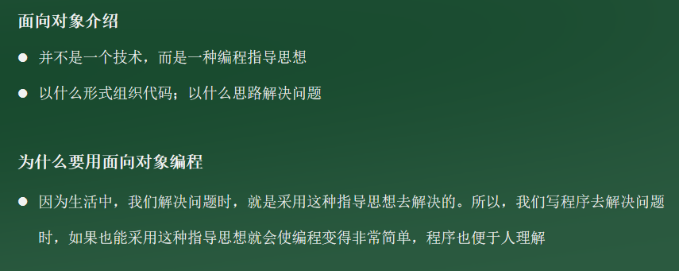

在程序中也把现实世界的具体事物全部看成一个一个的对象来解决问题按照面向对象编程来设计程序：程序代码符合人类思维习惯，更易理解、更简单

### 面向对象和面向过程的区别

```java
面向过程：是一种以过程为中心的编程思想，实现功能的每一步，都是自己实现的
面向对象：是一种以对象为中心的编程思想，通过指挥对象实现具体的功能

面向对象思想小结：
  可观存在的任何一种事物，都可以看做为程序中的对象
  使用面向对象思想可以将复杂的问题简单化
  将我们从执行者的位置，变成了指挥者
```

### 什么是类

我们将其理解为对象的设计图

```java
类是对现实生活中一类具有共同属性和行为的事物的抽象
【类】是对事物，也就是对象的一种描述， 根据类去创建对象
```

#### 类的组成

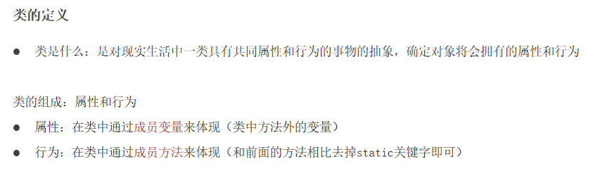

类的重要性：类是Java程序的基本组成单位。也就是说，我们在讲解面向对象的时候，类是我们最基本的组成元素，我们必须先写一个类，才能有对象。到底什么是类呢？我们前面说过，类是对现实生活中一类具有共同属性和行为的事物的抽象，确定对象将会拥有的属性和行为对象有什么，我们用属性来表示，对象可以干什么，我们用行为来表示。也就是说我们在定义一个类的时候主要由两方面组成。属性和行为。在这里顺带说一下，代码中属性和行为是通过成员变量和成员方法来体现的。

```java
属性
该事物的各种特征
	例如黑马学生事物的属性：姓名、年龄、毕业院校…
行为
该事物存在的功能（能够做的事情）
	例如黑马学生事物行为：学习、Java编程开发
```

### 什么是对象

对象有什么啊，能够干什么啊。对应的就是对象的属性和行为。

```
是能够看得到摸得着的真实存在的实体。
```

```
类是对象的抽象，对象是类的实体。
```

#### 对象的组成

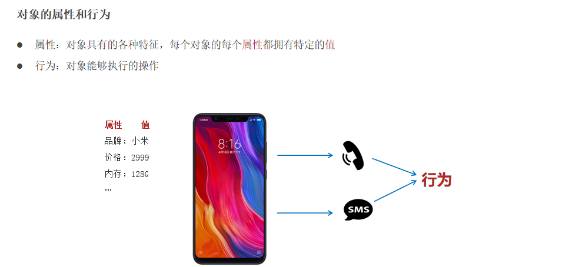

属性，就是对象具有的各种特征。我们可以把它简单的理解为：有什么。例如，我们前面在说手机的时候，说了手机的品牌，价格，内存大小等信息。这就是手机有什么。而每个对象呢，它都有自己的特定值，例如说：我们小米手机这个对象呢，它的价格是是2999元，内存时候是128G的，屏幕尺寸是6.21的，摄像头像素是1200万的等。它会有一些特定的值，我们把这些特定值，就称为对象的属性。那什么是对象的行为呢？

```
属性
对象具有的各种特征，每个对象的每个属性都拥有特定的值。
	例如手机的价值、内存、型号
行为
对象能够操作的操作
	例如打电话、接电话
```

## 类的定义和对象的使用

### 类的创建

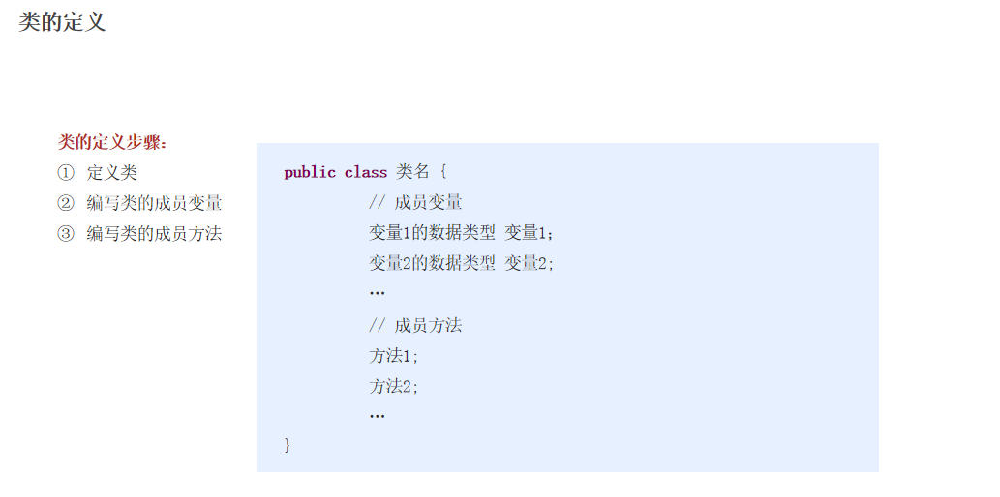

```java
/*
    public class 类名 {
          // 成员变量
          变量1的数据类型 变量1；
          变量2的数据类型 变量2;
          …
           // 成员方法
          方法1;
          方法2;
}

 */
public class Student {
    //成员变量 属性
    String name;
    int age;
    //成员方法 行为
    public void study(){
        System.out.println("GOOD GOOD STUDY DAY DAY UP");
    }
}
```

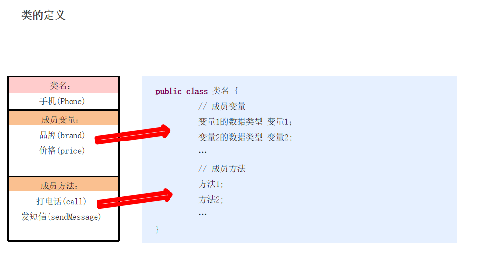

###  对象的创建和使用

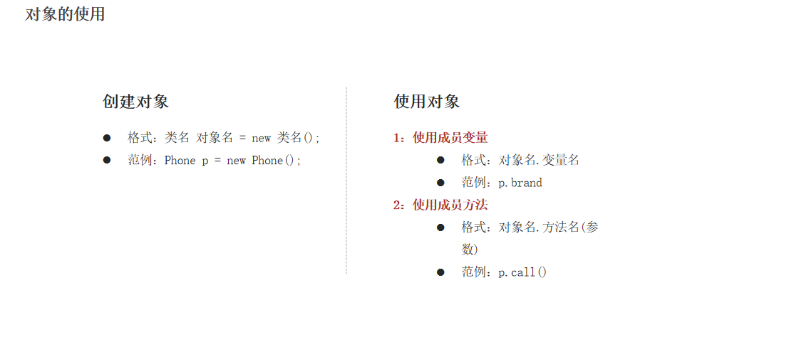

```java
/*
    创建对象
        格式：类名 对象名 = new 类名();
        范例：Student s = new Student();
    使用对象
        1：使用成员变量
        格式：对象名.变量名
        范例：p.name
        2：使用成员方法
        格式：对象名.方法名()
        范例：p.study();
 */
public class Test01Student {
    public static void main(String[] args) {
        Student stu = new Student();
        System.out.println(stu); //com.itheima.Student@776ec8df
        /*
        com.itheima.Student@776ec8df
        com.itheima.Student :包名 + 类名 称为：全类名
        @ ：分割符
        776ec8df： 十六进制的内存地址
         */
        //对象的使用
        // 对象名.属性名
        stu.name = "张三";
        stu.age = 18;
        // 对象名.方法名();
        stu.study();

        //取值
        String x = stu.name;
        System.out.println("x = "+x);
        int y = stu.age;
        System.out.println("y = "+y);
    }
}

```


### 面向对象入门小结

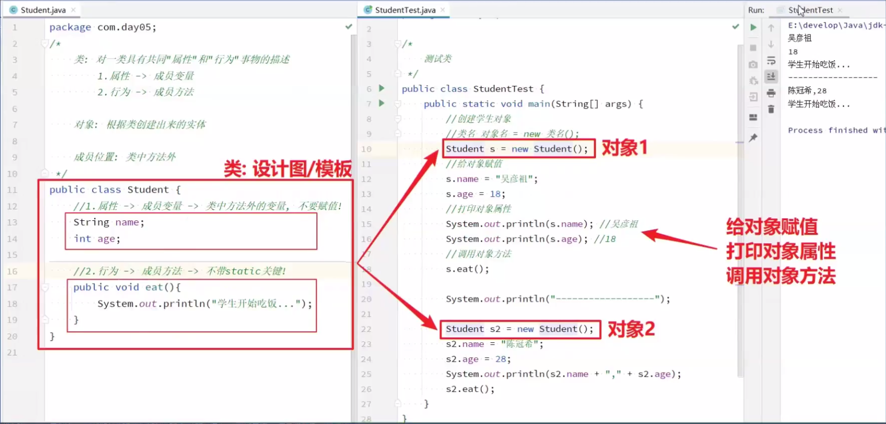

```java
/*
    类：  类是对同一类事物的描述，具有相同属性和行为为的一类事物统称
    对象： 对象是具体存在事物，就是类的实体，是类的具体体现；
    创建类：
        public class 类名{
            属性： 成员变量
            行为： 成员方法
        }
        public class Student{
            //属性： 成员变量
            String name;
            int age;
            //行为： 成员方法
            public void study(){
                sout("好好学习");
            }
        }
    创建对象：
        格式：
            类名 对象名/变量名 = new 类名();
        步骤：
            1.创建测试类
            2.书写main方法
            3.在main方法中创建对象
                Student stu = new Student();
    使用对象:
        步骤：
            1.使用属性或者叫使用成员变量 进行赋值
            格式：
                对象名.属性名 = 值;
                对象名.成员变量 = 值;
                stu.name = "张三";
                stu.age = 18;
             2.使用属性或者叫使用成员变量 进行取值
             格式：
                成员变量的数据类型 变量名 = 对象名.成员变量名;
                String x = stu.name;
                int y = stu.age;
                输出取值
                sout(stu.name);
                sout(stu.age);
              3.使用成员方法
              格式：
                对象名.成员方法名();

 */
public class Test02面向对象入门小结 {
}
```

## 面向对象的练习

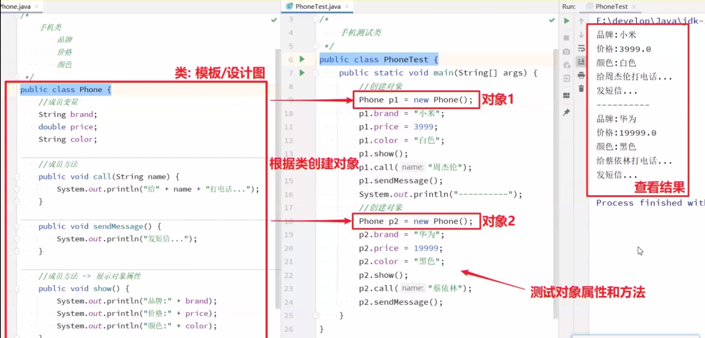

```java
public class Phone {
    String brand; //品牌
    double price; //价格

    //成员方法：打电话，发短信
    public void call(){
        System.out.println("打电话，说情话");
    }
    public void sendMessage(){
        System.out.println("发短信，他走了，你可以来了！");
    }
}

public class Test03Phone {
    public static void main(String[] args) {
        //创建对象
        Phone phone = new Phone();
        //调用成员变量
        phone.brand = "XIAOMI";
        phone.price = 2999.0;

        String brand = phone.brand;
        double price = phone.price;
        System.out.println(brand);
        System.out.println(price);
        //调用成员方法
        phone.call();
        phone.sendMessage();
    }
}
```

```java
public class TV {
    String brand;
    double price;

    public void watchTv(){
        System.out.println("正在播放新闻联播");
    }
}

public class TestTV {
    public static void main(String[] args) {
        //创建对象
        TV tv = new TV();
        //成员变量赋值
        tv.brand = "HUAWEI";
        tv.price = 188888.88;
        //成员变量取值
        String brand = tv.brand;
        double price = tv.price;
        System.out.println(brand);
        System.out.println(price);

        System.out.println(tv.brand);
        System.out.println(tv.price);

        //使用成员方法
        tv.watchTv();
    }
}
```

```java
public class 洗衣机 {
    String 品牌;
    double 价格;

    public void 洗衣服(){
        System.out.println("一个会中文的洗衣机在洗衣服");
    }
}
public class 测试洗衣机类 {
    public static void main(String[] args) {
        洗衣机 隔壁老王家 = new 洗衣机();
        //属性的使用
        隔壁老王家.品牌 = "海尔兄弟";
        隔壁老王家.价格 = 888.0;

        String x = 隔壁老王家.品牌;
        double y = 隔壁老王家.价格;
        System.out.println(x);
        System.out.println(y);
        System.out.println(隔壁老王家.品牌);
        System.out.println(隔壁老王家.价格);
        //行为的使用
        隔壁老王家.洗衣服();
    }
}
```

## 面向对象

### private 关键字和this关键字

private是一个权限修饰符，可以修饰成员，私有的意思

被private修饰的成员，只能在本类中进行访问（外界不能直接使用)

针对被private修饰的成员变量，提供对应的get和set方法

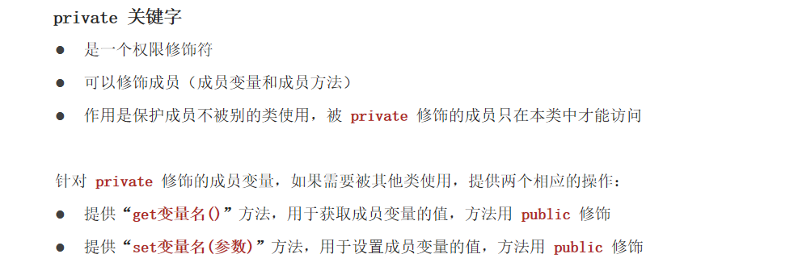

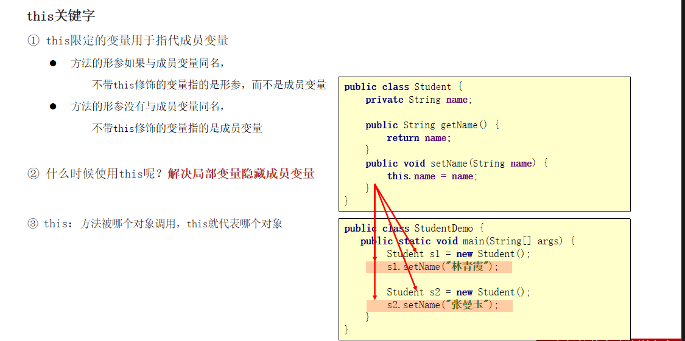

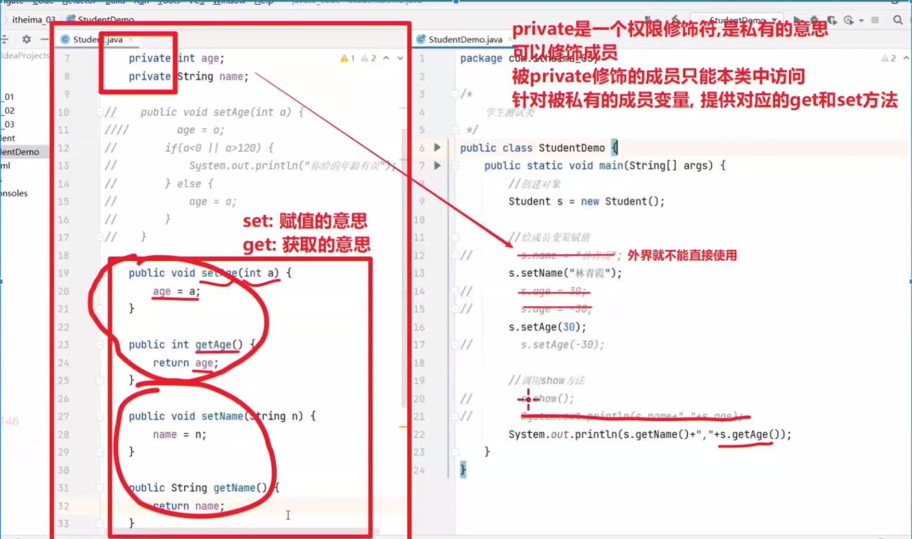

```java
/*
    private: 修饰成员变量
        表示私有的，外界不能直接访问，只能在本类中访问
        如果测试类中本类的对象，需要访问私有成员变量 赋值，在本类提供setXxx 给私有成员变量赋值
        如果测试类中本类的对象，需要访问私有成员变量 取值，在本类提供getXxx 给私有成员变量取值
    this关键字：
        1.区分成员变量和局部变量
        2.代表当前对象的引用，那个对象调用此方法，方法中的this，就是此对象
 */
public class Test01Student {
    public static void main(String[] args) {
        //创建对象
        Student student = new Student();
        //使用成员变量
        //student.name = "林青霞";
        student.setName("林青霞");
        //student.age = 300; // 0 -- 120
        student.setAge(16);


//        System.out.println(student.name);
        //System.out.println(student.age);
        String name = student.getName();
        System.out.println(name);
        int age = student.getAge();
        System.out.println(age);

        Student student1 = new Student();
        student1.setName("王祖贤");
        student1.setAge(17);

        System.out.println(student1.getName());
        System.out.println(student1.getAge());
    }
}
```

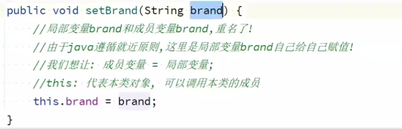

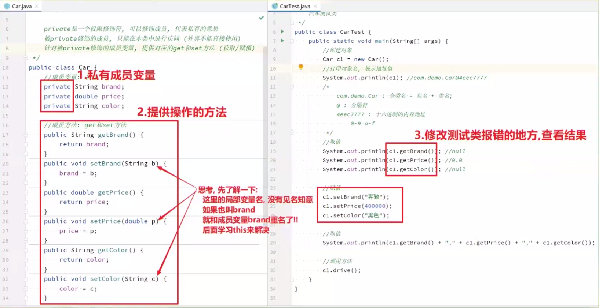

```java
public class Student {
    private String name;
    private int age;

    public void setAge(int age){
        if (age>0&&age<=120){
            this.age = age;
        }else {
            System.out.println("您给的年龄不合理！");
        }
    }
    public int getAge(){
        return age;
    }

    public void setName(String name){
        this.name = name;
    }
    public String getName(){
        return name;
    }

    public void study(){
        System.out.println("好好学习，天天向上！");
    }
    public void eat(){
        System.out.println("吃饭饭！");
    }
    public void sleep(){
        System.out.println("单身狗，抱着自己，睡觉觉！");
    }
}
```

### 构造方法

构造方法注意事项：

- 方法名必须和类名一致
- 每new一次对象，自动执行一次空参构造（加载时机)
- 带参构造的本质，·就是在创建对象的同时，完成赋值·（赋所有值)
- 如果我们不提供构造，系统提供一个默认的空参构造;如果我们提供带参构造，系统就不会给出空参了
- 结论:两种构造都显示写出来， java允许方法重载的!

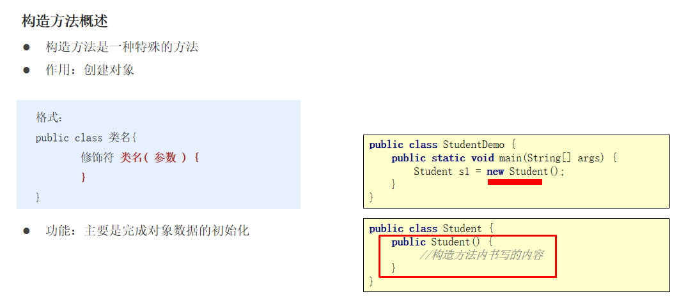

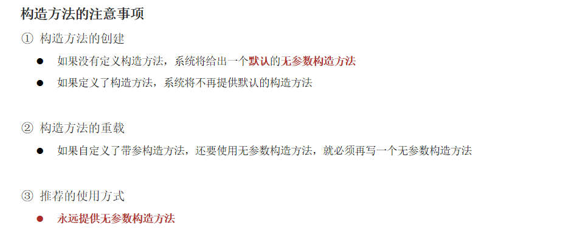

```java
/*
    构造方法：
        作用：构造作用用来创建对象和new关键字
        格式：
            格式1： public 类名(){}
            格式2： public 类名(参数列表){......}

    特点：
        1.如果本类中没有构造方法，JVM会默认提供一个无参的构造方法
        2.构造方法可以重载
        3.构造方法没有返回值，也不能使用 void
        4.构造方法中没有return关键字 ,可以写，但是没有必要，非要写return;
 */
public class Test02Phone {
    public static void main(String[] args) {
        Phone phone = new Phone();
        Phone xiaomi = new Phone("XIAOMI");
        Phone phone1 = new Phone(2999.0);
        Phone huawei = new Phone("HUAWEI",17998.0);

    }
}

```

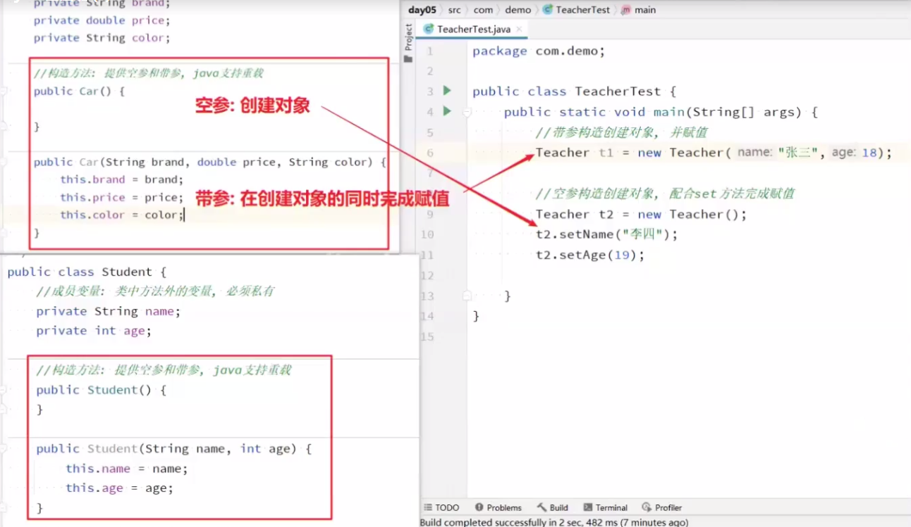

```java
/*
标准类的编写：
    1.成员变量私有化 提供getXxx和SetXxx方法
    2.提供空参满参的构造方法

 */
public class Phone {
   private String brand;
   private double price;
   private String productAddress;
   //无参构造方法
   public Phone(){
       System.out.println("无参构造方法被调用！");
   }
   /*public Phone(String productAddress){
       this.productAddress = productAddress;
   }*/
   //有参构造方法
    public Phone(String brand){
        System.out.println("有参构造方法被调用！ brand");
       this.brand = brand;
    }
    public Phone(double price){
        System.out.println("有参构造方法被调用！ price");
        this.price = price;
    }

    public Phone(String brand,double price){
        System.out.println("满参构造方法被调用！ price");
       this.brand = brand;
       this.price = price;
    }

    public String getBrand() {
        return brand;
    }

    public void setBrand(String brand) {
        this.brand = brand;
    }

    public double getPrice() {
        return price;
    }

    public void setPrice(double price) {
        this.price = price;
    }

    public void call(){
        System.out.println("打电话");
    }
    public void sendMessage(){
        System.out.println("发短信");
    }
}

```

### 面向对象的特征（封装）

- 封装概述

是面向对象三大特征之一（封装，继承，多态)。

是面向对象编程语言对客观世界的模拟，客观世界里成员变量都是隐藏在对象内部的，外界是无法直接操作的。

- 封装原则：

将类的某些信息隐藏在类内部，不允许外部程序直接访问，而是通过该类提供的方法来实现对隐藏信息的操作和访问

成员变量private，提供对应的getXxx()/setXxx()方法

- 封装好处：

通过方法来控制成员变量的操作，提高了代码的安全性

把代码用方法进行封装，提高了代码的复用性

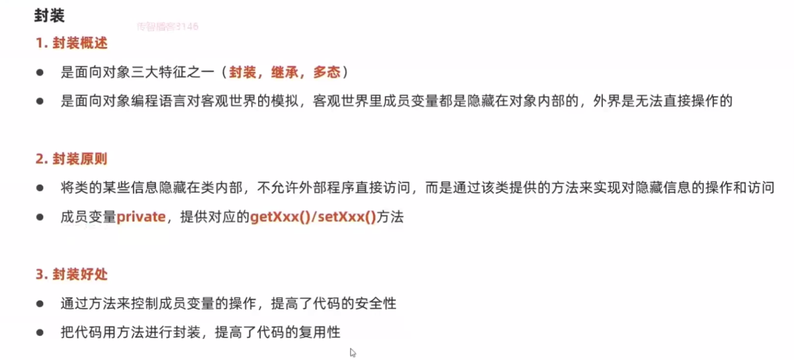

```java
/*
    面向对象的特征：
        封装：
            表现形式：
                1.private 关键字 修饰成员变量
                2.特定功能代码 封装方法
                3.具有形同属性和行为一类事物，封装成类
        继承：
            父类和子类产生关系，extends
        多态：
            父类的引用存放子类对象
 */

public class Test03 {
    public static void main(String[] args) {
        int [] arr = {1,2,3,4,5,6,7,8,9};
        //输出数组的元素，如下：[1,2,3,4,5,6,7,8,9]
        printArray(arr);
    }

    public static void printArray(int[] arr) {
        System.out.print("[");
        for (int i = 0; i < arr.length; i++) {
            if (i == arr.length-1){
                System.out.print(arr[i]);
            }else {
                System.out.print(arr[i]+", ");
            }
        }
        System.out.println("]");
    }
}

class Cat extends Animal{
    public static void main(String[] args) {
        Animal cat = new Cat();
    }
}
class Animal{}

```

### 局部变量和成员变量区别

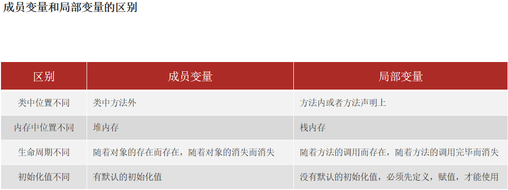

```java
/*
    局部变量和成员变量区别：
        代码中的位置：
            成员变量：类中方法外
            局部变量：在方法的声明上 或者方法内部
        在内存中的位置：
            成员变量：在堆中
            局部变量：在栈中
        声明周期不一样：
            局部变量：随着方法的调用而存在，随着方法的弹栈而消失
            成员变量：随着对象的创建而存在，对象对象的消失而消失
        初始化值：
            局部变量没有默认，成员变量有默认值

 */
public class Phone {
    private String name;
    private double price;
    private String productAddress;

    //提供空参满参的构造方法

    public Phone() {
    }

    public Phone(String name, double price, String productAddress) {
        this.name = name;
        this.price = price;
        this.productAddress = productAddress;
    }
    //提供get和set方法

    public String getName() {
        return name;
    }

    public void setName(String name) {
        this.name = name;

    }

    public double getPrice() {
        return price;
    }

    public void setPrice(double price) {
        this.price = price;
    }

    public String getProductAddress() {
        return productAddress;
    }

    public void setProductAddress(String productAddress) {
        this.productAddress = productAddress;
    }
}

```

```java
public class Test01Phone {
    public static void main(String[] args) {
        Phone phone = new Phone();
        phone.setName("HUAWEI");
        phone.setPrice(17988.0);
        phone.setProductAddress("Made in China");
        System.out.println(phone.getName());
        System.out.println(phone.getPrice());
        System.out.println(phone.getProductAddress());
    }
}
```

### 标准类的编写

```java
/*
标准类的编写：
    1.成员变量私有化 提供getXxx和SetXxx方法
    2.提供空参满参的构造方法

 */
public class Phone {
    private String name;
    private double price;
    private String productAddress;

    //提供空参满参的构造方法

    public Phone() {
    }

    public Phone(String name, double price, String productAddress) {
        this.name = name;
        this.price = price;
        this.productAddress = productAddress;
    }
    //提供get和set方法

    public String getName() {
        return name;
    }

    public void setName(String name) {
        this.name = name;

    }

    public double getPrice() {
        return price;
    }

    public void setPrice(double price) {
        this.price = price;
    }

    public String getProductAddress() {
        return productAddress;
    }

    public void setProductAddress(String productAddress) {
        this.productAddress = productAddress;
    }
}
```

### 标准类练习

编写电影类：

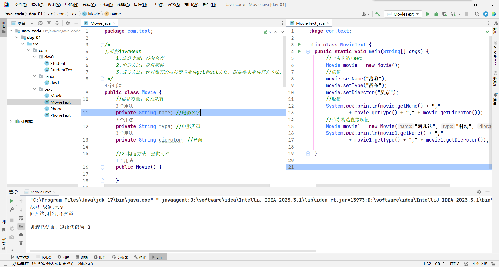

```java
package com.text;

/*
标准的javaBean
    1.成员变量：必须私有
    2.构造方法：提供两种
    3.成员方法：针对私有的成员变量提供get和set方法，根据要求提供其它方法。
 */
public class Movie {
    //成员变量：必须私有
    private String name; //电影名字
    private String type; //电影类型
    private String dierctor; //导演

    //2.构造方法：提供两种
    public Movie() {

    }

    public Movie(String name, String type, String dierctor) {
        this.name = name;
        this.type = type;
        this.dierctor = dierctor;
    }

    //3.成员方法：针对私有的成员变量提供get和set方法，根据要求提供其它方法。
    public String getName() {
        return name;
    }

    public void setName(String name) {
        this.name = name;
    }

    public String getType() {
        return type;
    }

    public void setType(String type) {
        this.type = type;
    }

    public String getDierctor() {
        return dierctor;
    }

    public void setDierctor(String dierctor) {
        this.dierctor = dierctor;
    }
}


package com.text;

public class MovieText {
    public static void main(String[] args) {
        //空参构造+set
        Movie movie = new Movie();
        //赋值
        movie.setName("战狼");
        movie.setType("战争");
        movie.setDierctor("吴京");
        //取值
        System.out.println(movie.getName() + ","
                + movie.getType() + "," + movie.getDierctor());
        //带参构造直接赋值
        Movie movie1 = new Movie("阿凡达", "科幻", "不知道");
        System.out.println(movie1.getName() + ","
                + movie1.getType() + "," + movie1.getDierctor());

    }
}

```


## 对象内存图

不同的对象，在内存中有不同的位置。

```
system.out.println(c1); / / com.demo.car@4eec7777
```

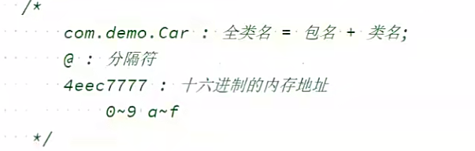

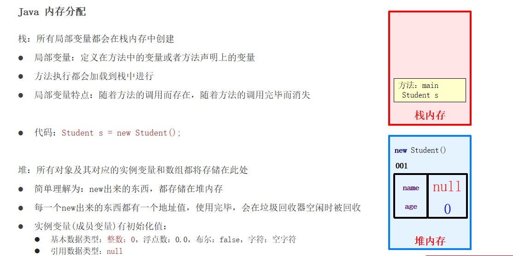


## 垃圾回收机制

### 垃圾回收机制的意义

```java
Java语言中一个显著的特点就是引入了垃圾回收机制，使c++程序员最头疼的内存管理的问题迎刃而解，它使得Java程序员在编写程序的时候不再需要考虑内存管理。

ps:内存泄露是指该内存空间使用完毕之后未回收，在不涉及复杂数据结构的一般情况下，Java 的内存泄露表现为一个内存对象的生命周期超出了程序需要它的时间长度，我们有时也将其称为“对象游离”。
```

### 垃圾回收机制中的算法 引用计数法(Reference Counting Collector)

```java
Java语言规范没有明确地说明JVM使用哪种垃圾回收算法，但是任何一种垃圾回收算法一般要做2件基本的事情：（1）发现无用信息对象；（2）回收被无用对象占用的内存空间，使该空间可被程序再次使用。
```

```java
引用计数法(Reference Counting Collector) 算法分析
  引用计数是垃圾收集器中的早期策略。在这种方法中，堆中每个对象实例都有一个引用计数。当一个对象被创建时，且将该对象实例分配给一个变量，该变量计数设置为1。当任何其它变量被赋值为这个对象的引用时，计数加1（a = b,则b引用的对象实例的计数器+1），但当一个对象实例的某个引用超过了生命周期或者被设置为一个新值时，对象实例的引用计数器减1。任何引用计数器为0的对象实例可以被当作垃圾收集。当一个对象实例被垃圾收集时，它引用的任何对象实例的引用计数器减1。
```

```java
引用计数法(Reference Counting Collector) 优缺点
  优点：
　　引用计数收集器可以很快的执行，交织在程序运行中。对程序需要不被长时间打断的实时环境比较有利。
  缺点： 
　　无法检测出循环引用。如父对象有一个对子对象的引用，子对象反过来引用父对象。这样，他们的引用计数永远不可能为0.
引用计数算法无法解决循环引用问题:
public class Main {
    public static void main(String[] args) {
        MyObject object1 = new MyObject();
        MyObject object2 = new MyObject();
         
        object1.object = object2;
        object2.object = object1;
         
        object1 = null;
        object2 = null;
    }
}
最后面两句将object1和object2赋值为null，也就是说object1和object2指向的对象已经不可能再被访问，但是由于它们互相引用对方，导致它们的引用计数器都不为0，那么垃圾收集器就永远不会回收它们。
```

