# 数组

**今日目标：**

- 能够知道数组的作用
- 能够根据需求完成数组的定义和初始化
- 能够使用数组完成授课案例
- 能够理解数组内存图

## 一维数组

### 数组概述和课程安排

来，继续啊，下面我们来学习数组。

那什么是数组呢？为了帮助大家理解，这里我们来看这样的一个场景：


看这里，有一个学员的考试成绩，为了存储这个学员的考试成绩，我们可以采用一个变量进行存储。

但是，假如这里有很多个学员的考试成绩，我们要存储该怎么办呢？


估计有同学就想到了，采用多个变量存储不就行了吗。对，想的没错。

确实可以采用多个变量进行存储，只不过将来要对这多个变量进行操作就比较麻烦了，

比如说：找到成绩最高的学员。按照我们学过的获取两个数的较大值，需要编写大量的判断逻辑才能完成这个操作。

很明显，采用多个变量存储不是好的解决方案。

那怎么办呢？我们再来回顾一下，目前出现的问题是：

1：一次性声明大量的用于存储数据的变量，

2：要存储的数据通常都是同类型数据，例如：考试成绩。

为了解决这种大量的同类型的数据存储，Java就提供了数组供我们使用。

比如说：下面这种格式，就是定义了一个存储多个考试成绩的数组。

- int[] scores = {100,100,100,100,100,100,100…};

对比一下，比定义多个变量要方便多了，而且操作起来也是很方便的，至于怎么操作，一会我们详细讲解。

好了，知道了数组可以解决这种问题后，我们给数组下一个定义：

- **数组(array)：**是一种用于存储<font color='red'>**多个相同数据类型**</font>的存储模型(可以理解为容器)。

知道了什么是数组后，我们来说一下数组这一块的课程安排：

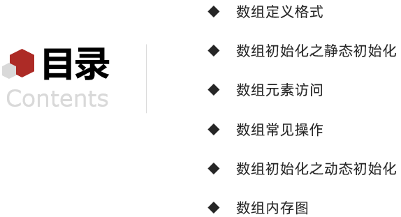

首先，我们讲解数组的定义格式，这样我们就能够定义数组了。

接着，我们讲解数组的初始化，这样我们就能够给数组中的元素赋值了。

然后，我们讲解数组元素的访问和常见操作，这样我们就能够应用数组解决常见的问题了。

最后，我们讲解数组内存图，这样我们就能够对数组在内存中的存储和操作做到知其然也知其所以然。

好了，到此关于数组的概述和课程安排我们就先讲到这里。

### 数组定义和静态初始化

来，继续啊，下面我们来学习数组定义格式。

数组有两种定义格式：

- **格式1：**数据类型[] 变量名;
- 范例：              int[] arr;
- 定义了一个int类型的数组，数组名是arr

- **格式2：**数据类型 变量名[];
- 范例：              int arr[];
- 定义了一个int类型的变量，变量名是arr数组

这两种格式在使用上是没有区别的，但是在阅读的时候是有一个小区别的？

我们先来看格式1：定义了一个int类型的数组，数组名是arr；再来看格式2：定义了一个int类型的变量，变量名是arr数组

很明显，格式1明确的告诉了我们定义的是一个数组，所以，在定义数组的时候，我们**推荐使用格式1**。

现在我们会定义数组了，但是数组中没有数据。而Java中的数组必须先初始化，然后才能使用。

所以，接着，我们来说一下数组的初始化。

- **所谓初始化：**就是为数组中的数组元素分配内存空间，并为每个数组元素赋值

- 注意：数组中的每一个数据，我们称之为数组中的**元素**

知道了什么是初始化后，我们来说一下数组中的初始化。

数组的初始化分为两种方式：一种是静态初始化，一种是动态初始化。

它们有各自的使用场景，后面我们会讲解到。

这里我们先讲解数组的静态初始化

- **静态初始化：**初始化时指定每个数组元素的初始值，由系统决定数组长度
- **格式：**数据类型[] 变量名 = new 数据类型[]{数据1,数据2,数据3,…};
- **范例：**int[] arr = new int[]{1,2,3};

针对这种格式呢？Java提供了一种简化的格式，让我们使用起来更方便

- **简化格式：**数据类型[] 变量名 = {数据1,数据2,数据3,…};
- **范例：**int[] arr = {1,2,3};

这样呢，我们就能够定义并初始化一个数组了。

好了，关于数组的定义和静态初始化我们就先讲到这里。

### 数组元素访问(获取和修改)

来，继续啊，下面我们来学习数组元素访问。

而在数组元素访问这一块，我们要学习两个知识：

1. 一个是数组变量的访问方式
2. 一个是数组内部保存的数据的访问方式

我们先来说，数组变量访问方式

- 它的格式是这样的：**数组名**

我们可以通过输出语句，输出数组名，就能够得到一个数据。那这个数据是什么呢？不着急，一会我们会演示的。

接着，我们来说，数组内部保存的数据的访问方式

- 它的格式是：**数组名[索引]**

这个格式没有什么问题，但是这里的索引是什么呢？为了讲解这个索引，我们来看一下这样的一个场景：

在这里有一排人，在这排着队呢，为了知道他们站的位置，给他们进行1,2,3.。。。的编号。


这里的编号是从1开始的。

而计算机中编号习惯从0开始，这个**从0开始的编号，我们就称之为索引**。


接着，我们来说一下：

- 索引是数组中数据的编号方式
- 作用：用于访问数组中的数据使用，数组名[索引]等同于变量名，是一种特殊的变量名
- 它还有这样的几个特征：
  - 特征①：索引从0开始
  - 特征②：索引是连续的
  - 特征③：索引逐一增加，每次加1

知道了如何访问数组变量以及数组中的元素后，下面我们到idea中去演示一下。

```java
/*
    数组变量访问方式
        格式：数组名

    数组内部保存的数据的访问方式
        格式：数组名[索引]
 */
public class ArrayDemo {
    public static void main(String[] args) {
        //定义一个数组，并进行初始化
//        int[] scores = new int[]{93,96,99};
        int[] scores = {93,96,99};

        //输出数组名
        System.out.println(scores); //[I@776ec8df

        //输出数组中的元素
        System.out.println(scores[0]);
        System.out.println(scores[1]);
        System.out.println(scores[2]);
        System.out.println("-----------");

        //修改数组中的元素
        scores[0] = 100;
        scores[1] = 98;
        scores[2] = 95;
        //再次输出数组中的元素
        System.out.println(scores[0]);
        System.out.println(scores[1]);
        System.out.println(scores[2]);
    }
}
```

讲解完毕后，大家赶快动手练习一下吧。

### 案例

#### 案例1(数组常见操作之遍历)

来，继续啊，下面我们来学习数组常见操作，数组常见操作有很多，这里我们先讲解下面这几个：

- 遍历
- 获取最大值
- 元素打乱

其他的操作，后续我们会进行讲解。

首先，我们来讲解数组遍历，那什么是数组遍历？我们一起来说一下：

- 数组遍历指的是：**获取数组中的每一个元素**，我们可以把获取到的元素输出在控制台

知道了什么是数组遍历后，我们到IDEA中去实现一下，然后再回来总结。

```java
/*
    遍历
 */
public class ArrayTest01 {
    public static void main(String[] args) {
        //定义数组并初始化
        int[] arr = {77, 88, 99, 66, 55, 44};

        //获取数组中的元素
//        System.out.println(arr[0]);
//        System.out.println(arr[1]);
//        System.out.println(arr[2]);
//        System.out.println(arr[3]);
//        System.out.println(arr[4]);

        //用循环改进
//        for (int i=0; i<5; i++) {
//            System.out.println(arr[i]);
//        }

        //格式：数组名.length
//        System.out.println(arr.length);

        for (int i=0; i<arr.length; i++) {
            System.out.println(arr[i]);
        }
    }
}
```

最后，我们回到资料总结一下：

**什么是数组遍历：**

- 获取数组中的每一个元素，我们可以把获取到的元素输出在控制台

**获取数组长度(元素个数)：**

- 格式：数组名.length
- 范例：<font color='red'>**arr.length**</font>

**数组遍历<font color='red'>通用格式</font>：**

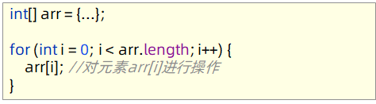

**注意：**数组遍历指的是把数组中的元素取出来，取出来之后可以(打印，求和，判断…)

数组遍历通用格式：
	    for (int i = 0; i < scores.length; i++) {
            scores[i]
        }
注意：数组遍历指的是把数组中的元素取出来，取出来之后可以(打印，求和，判断…)。
选择哪种操作，得根据我们的实际需求来看。

好了，关于数组常见操作之遍历我们就先讲到这里

讲解完毕后，大家赶快动手练习一下吧。

#### 案例2(数组常见操作之获取最大值)

来，继续啊，下面我们来学习数组中获取最大值：

而在讲解具体的实现之前，我们先通过一个场景，让大家对最值有一个认知：

看这里，这是一组家庭成员：


给出一组数据，这些数据表示的是他们的年龄。68是最大年龄，4是最小年龄，所以，68和4就可以被称之为最值。

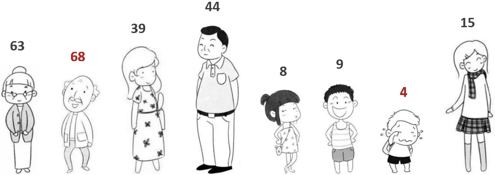

再给出一组数据，这些数据表示的是他们的身高，171是最高身高，81是最低身高，所以，171和81就可以被称之为最值。

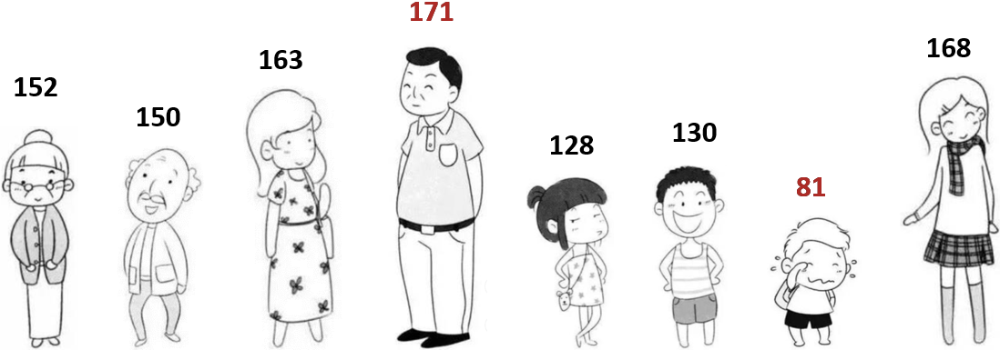

那这里的171为什么就是最高身高呢？

很明显，要想说171是最高身高，我们就要把这些数据从头到尾比较了一遍，最终找到了最高身高171。

而要进行比较，我们的先把这些数据保存起来。这里我们就采用数组把这些数据给保存起来。

知道了大量同类型数据用数组保存和最值的知识后，我们来看一下我们的需求：

- 我这里有一个数组，我现在要获取数组中的最大值

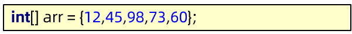

如何实现呢？接下来，我们说一下思路：

1：因为我们最终，要得到最大值，所以，这里我们定义一个变量，用于保存最大值。

但是，它没有初始值，给多少比较合适呢？我总不能拿数组以外的数据进来吧，因为我们最终获取的是数组中的最大值。所以，我们就要从数组中找一个值作为初始值。

一般来说，我们取数组中第一个元素作为参照值。

2：这样我们的最大值变量就有初始值了，接下来，我们与数组中剩余的数据逐个比较，比完之后，max中最终保存的是最大值。

这个动作怎么实现呢？我们来说一下：获取索引1-4，为什么不从0开始呢？因为0索引位置的值已经作为初始值了。

3：我们每次比较，需要把最大值保存到max变量中，这个动作，我们可以通过if语句实现。

4：当循环结束后，打印max变量就可以了，这个max里面保存的就是最大值。

说完了数组获取最大值的思路后，我们到idea中去实现一下：

```java
/*
    获取最大值
 */
public class ArrayTest02 {
    public static void main(String[] args) {
        //定义数组
        int[] arr = {12, 45, 98, 73, 60};

        //定义变量max存储最大值，取第一个数据为变量的初始值
        int max = arr[0];

        //与数组中剩余数据逐个比对，每次比对将最大值保存到变量max中
        for (int i=1; i<arr.length; i++) {
            if(arr[i] > max) {
                max = arr[i];
            }
        }

        //循环结束后输出变量max的值
        System.out.println("max:" + max);
    }
}
```

讲解完毕后，大家赶快动手练习一下吧。

#### 案例3(数组常见操作之元素打乱)

来，继续啊，下面我们来学习数组中元素打乱。

那什么是元素打乱呢？

- 元素打乱就是把数组中的元素随机交换位置，每次运行都可能产生不一样的结果

比如：**arr** **= {12, 45, 98, 73, 60};**

**遍历：**

- 正常情况下：12,45,98,73,60
- 元素打乱后：45,73,12,60,98

**涉及到的操作：**

- 获取数组中元素的随机索引
  - Random r = new Random();
  - int index = r.nextInt(arr.length);
- 数组中元素交换

获取随机索引比较好实现，但是元素交换该如何实现呢？

这里为了帮助大家更好的理解，我们给出这样的一个场景来理解数据交换：

把啤酒杯和红酒杯里面的酒进行交换


如何实现呢？

第一步：找来一个同类型的空酒杯


第二步：把红酒倒入到空酒杯中


第三步：把啤酒倒入到曾经装红酒的杯子中


第四步：把红酒从临时找来的杯子中倒入到曾经装啤酒的杯子中


这样我们就实现了啤酒杯和红酒杯里面的酒进行交换。这种思想同样也适合我们程序中的数据交换。

下面我们到IDEA中去演示一下数据的交换：

```java
/*
    数据交换
 */
public class DataSwap {
    public static void main(String[] args) {
//        int a = 10;
//        int b = 20;
//        System.out.println("交换前：a=" + a + ",b=" + b);
//        int temp = a;
//        a = b;
//        b = temp;
//        System.out.println("交换后：a=" + a + ",b=" + b);

        int[] arr = {11, 22, 33, 44, 55};
        System.out.println("交换前：arr[0]=" + arr[0] + ",arr[4]=" + arr[4]);
        int temp = arr[0];
        arr[0] = arr[4];
        arr[4] = temp;
        System.out.println("交换后：arr[0]=" + arr[0] + ",arr[4]=" + arr[4]);
    }
}
```

数据的交换演示完毕后，下面我们就可以来实现把数组中的元素打乱了：

```java
import java.util.Random;

/*
    元素打乱
 */
public class ArrayTest03 {
    public static void main(String[] args) {
        //定义数组
        int[] arr = {12, 45, 98, 73, 60};

//        Random r = new Random();
//        int index = r.nextInt(arr.length);
//
//        //第一次交换
//        int temp = arr[0];
//        arr[0] = arr[index];
//        arr[index] = temp;
//
//        //第二次交换
//        index = r.nextInt(arr.length);
//        temp = arr[1];
//        arr[1] = arr[index];
//        arr[index] = temp;

        Random r = new Random();
        for (int i = 0; i < arr.length; i++) {
            int index = r.nextInt(arr.length);

            int temp = arr[i];
            arr[i] = arr[index];
            arr[index] = temp;
        }

        //遍历数组
        for (int i = 0; i < arr.length; i++) {
            System.out.println(arr[i]);
        }
    }
}
```

讲解完毕后，大家赶快动手练习一下吧。

### 数组动态初始化

来，继续啊，下面我们来学习数组初始化之动态初始化。

前面呢，我们已经学习过了静态初始化，也就是初始化时指定每个数组元素的初始值。

而动态初始化呢？初始化时只指定数组长度，由系统为数组分配初始值

这里我们来看一下动态初始化的格式：

- **格式：**数据类型[] 变量名 = new 数据类型[数组长度];
- **范例：**int[] arr = new int[3];

表示我们定义了一个int类型的数组，初始化为3个元素。

知道了如何对数组进行动态初始化之后，下面我们到IDEA中去使用一下：

```java
/*
    动态初始化：初始化时只指定数组长度，由系统为数组分配初始值
    格式：数据类型[] 变量名 = new 数据类型[数组长度];
    范例：int[] arr = new int[3];
 */
public class ArrayDemo {
    public static void main(String[] args) {
        //格式：数据类型[] 变量名 = new 数据类型[数组长度];
        int[] arr = new int[3];

        //输出数组名
        System.out.println(arr); //[I@776ec8df

        //输出数组中的元素
        System.out.println(arr[0]);
        System.out.println(arr[1]);
        System.out.println(arr[2]);
        System.out.println("------------");

        //修改数组中的元素
        arr[0] = 10;
        arr[1] = 20;
        arr[2] = 30;

        //再次输出数组中的元素
        System.out.println(arr[0]);
        System.out.println(arr[1]);
        System.out.println(arr[2]);
    }
}
```

演示完毕之后，回到资料我们总结一下数组初始化的两种方式的**各自使用场景：**

- **静态初始化：**开始就存入元素值，适合一开始就能确定元素值的业务场景
- **动态初始化：**指定数组长度，后期赋值，适合开始知道数据的数量，但是不确定具体元素值的业务场景
- **注意：**两种初始化的方式是独立的，不可以混用

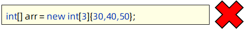

好了，关于数组初始化之动态初始化我们就先讲到这里。

讲解完毕后，大家赶快动手练习一下吧。

#### 案例4(数组元来自键盘录入)

来，继续啊，下面我们来做一个案例：数组元素来自键盘录入

首先呢，我们来看一下具体的需求：

- **需求：**定义一个可以存储5个元素的int数组，数据来自于键盘录入，最后遍历数组，把元素输出在控制台

首先，我们来简单的分析一下：

这个数组可以存储5个int类型的元素，但是数据来自于键盘录入，也就是先指定数组长度，后期赋值。

这很明显适合使用数组的动态初始化，所以，这里我们将采用动态初始化对数组进行初始化。

接着，数据来自于键盘录入，我们得知道这里要使用Scanner来实现。

明确了这两个内容后，下面我们到IDEA中一起去实现一下：

```java
import java.util.Scanner;

/*
    需求：定义一个可以存储5个元素的int数组，数据来自于键盘录入，最后遍历数组，把元素输出在控制台
 */
public class ArrayTest {
    public static void main(String[] args) {
        //定义一个数组，并进行动态初始化
        int[] arr = new int[5];

        //创建键盘录入对象
        Scanner sc = new Scanner(System.in);

//        //录入第1个数据
//        System.out.println("请输入第1个数据：");
////        int i = sc.nextInt();
////        arr[0] = i;
//        arr[0] = sc.nextInt();
//
//        //录入第2个数据
//        System.out.println("请输入第2个数据：");
//        arr[1] = sc.nextInt();

        for (int i = 0; i < arr.length; i++) {
            System.out.println("请输入第" + (i + 1) + "个元素：");
            arr[i] = sc.nextInt();
        }

        printArray(arr);

            //输出内容并换行
//        System.out.println("hello");
//        System.out.println("world");
            //输出内容不换行
//        System.out.print("hello");
//        System.out.print("world");
    }

    public static void printArray(int[] arr) {
        System.out.print("[");
        for (int i = 0; i < arr.length; i++) {
            if(i==arr.length-1) {
                System.out.print(arr[i]);
            }else {
                System.out.print(arr[i] + ", ");
            }
        }
        System.out.println("]");
    }

    /*
        参数：int[] arr
        返回值：void
     */
//    public static void printArray(int[] arr) {
//        for (int i = 0; i < arr.length; i++) {
//            System.out.println(arr[i]);
//        }
//    }
}
```

在讲解过程中，我们讲到了一个新的输出语句，不带ln的方法，它只输出内容，不换行。

而以前我们使用的输出语句，不仅仅把内容输出，而且在输出内容后，会加一个换行。

好了，关于案例数组元素来自键盘录入我们就先讲到这里。

讲解完毕后，大家赶快动手练习一下吧。

### 数组内存图

来，继续啊，下面我们来学习数组内存图。

这里呢，我们通过单个数组的内存图让大家了解一下数组在内存中的存储和使用就可以了。

整个过程讲解的是下图代码的执行流程，大家能够听懂即可。

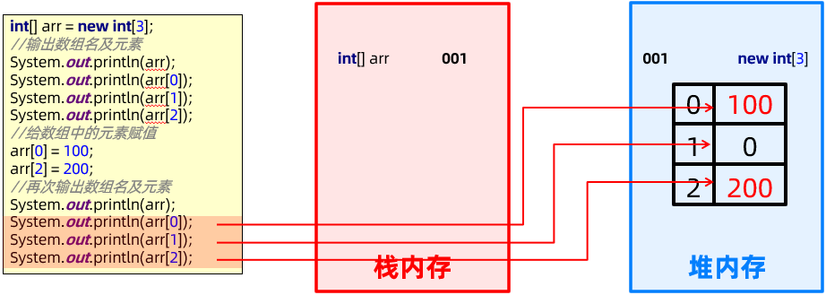

最后，我们自己编写代码验证一下：

```java
/*
    数组内存图代码
 */
public class ArrayTest01 {
    public static void main(String[] args) {
        int[] arr = new int[3];

        //输出数组名及元素
        System.out.println(arr);
        System.out.println(arr[0]);
        System.out.println(arr[1]);
        System.out.println(arr[2]);

        //给数组中的元素赋值
        arr[0] = 100;
        arr[2] = 200;

        //再次输出数组名及元素
        System.out.println(arr);
        System.out.println(arr[0]);
        System.out.println(arr[1]);
        System.out.println(arr[2]);
    }
}
```


由于仅仅是验证讲解的结论，故不需要练习。

### 数组使用中的两个小问题

来，继续啊，下面我们来讲解一下数组使用中的两个小问题。

先来看第一个问题：请问下列代码有问题吗？如果有，是什么问题？如何解决？

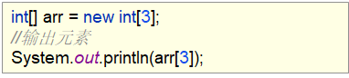

通过内存图进行讲解：

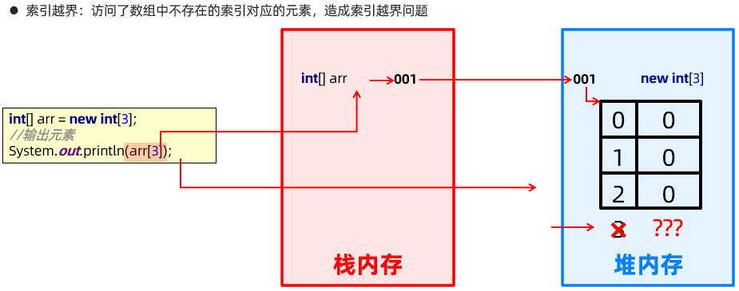

最终结论是：

- 有问题
- 访问了不存在的索引位置元素
- 修改不存在的索引为正确的索引。范围(0~数组长度-1)

再来看第二个问题：请问下列代码有问题吗？如果有，是什么问题？如何解决？

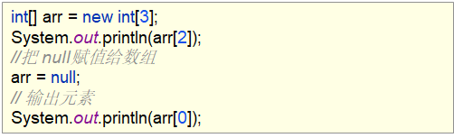

通过内存图进行讲解：

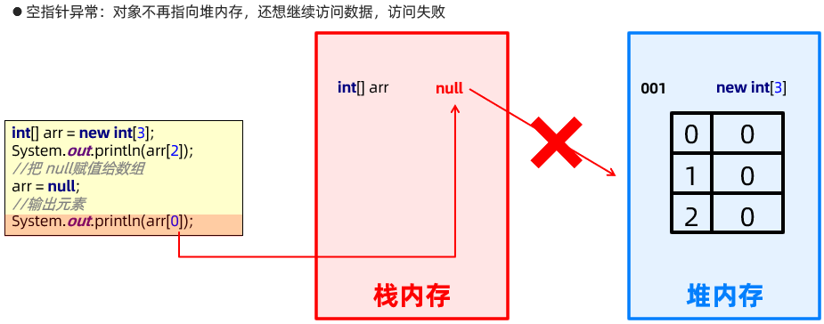

最终结论是：

- 有问题
- 对象设置为null，不在指向堆内存数据了，还想继续访问堆内存数据
- 对象在使用前，进行不为null的判断

讲解完毕后，到IDEA中再去通过代码验证一下：

```java
/*
    数组使用中的两个小问题
        1：索引越界：访问了数组中不存在的索引对应的元素，造成索引越界问题
            ArrayIndexOutOfBoundsException

        2：空指针异常：对象不再指向堆内存，还想继续访问数据，访问失败
            NullPointerException

        null：空值，引用数据类型的默认值，表示不指向任何有效对象
 */
public class ArrayTest02 {
    public static void main(String[] args) {
        int[] arr = new int[3];
        //输出元素
        //Exception in thread "main" java.lang.ArrayIndexOutOfBoundsException: Index 3 out of bounds for length 3
//        System.out.println(arr[3]);
        System.out.println(arr[2]);

        //把null赋值给arr
        arr = null;
        //输出元素
        //Exception in thread "main" java.lang.NullPointerException: Cannot load from int array because "arr" is null
        if(arr != null) {
            System.out.println(arr[0]);
        }
    }
}
```

由于仅仅是验证讲解的结论，故不需要练习。

## 二维数组

### 二维数组概述和课程安排

来，继续啊，下面我们来学习二维数组。前面我们讲解的数组，一般称之为一维数组。

为了帮助大家理解二维数组呢？这里我们来看这样的一个场景：

需求：我们要存储多个班级的学生的考试成绩，该怎么办呢？

如果要存储一个班级中多个学生的考试成绩，我们就可以采用数组来存储。

现在的问题是？多个班级的考试成绩，我们针对每个班级都采用数组存储。

第一个班级：数组1

第二个班级：数组2

第三个班级：数组3
…

但是多个班级，也可以采用数组存储啊。所以，Java就提供了二维数组供我们使用。

这里我们给二维数组一个简单的定义：

- **二维数组：**元素为一维数组的数组

知道了什么是二维数组后，我们再说一下二维数组的定义格式：

它有这样的三个格式，用[][]表示二维数组：

1. 数据类型[] [] 变量名;	int[] [] arr;	**推荐**
2. 数据类型 变量名[] [];	int arr[] [];
3. 数据类型[] 变量名[];	int[] arr[];

推荐使用第一种格式。

知道了什么是二维数组以及二维数组的定义格式后，我们来说一下二维数组这一块的课程安排：

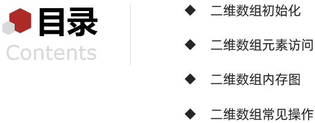

首先，我们讲解二维数组初始化，这样我们就能够给二维数组中的元素赋值了。

接着，我们讲解二维数组元素访问，这样我们就能够获取到二维数组中的数据了。

然后，我们讲解二维数组内存图，这样我们就能够对二维数组在内存中的存储和操作做到知其然也知其所以然。

最后，我们讲解二维数组常见操作，这样我们就能够应用二维数组解决常见的问题了。

好了，到此关于二维数组的概述和课程安排我们就先讲到这里。

### 二维数组初始化

来，继续啊，下面我们来学习二维数组初始化，和一维数组一样，二维数组初始化也有两种格式：

1. 静态初始化
2. 动态初始化

首先来看**静态初始化：**

- **格式：**数据类型[] [] 变量名 = new 数据类型[] []{{元素…},{元素…},{元素…},…};
- **范例：**int[] [] arr = new int[] []{{1,2,3},{4,5,6},{7,8,9}};

**解读：**

- 定义了一个二维数组
- 二维数组中有三个元素(一维数组)
- 每一个一维数组有三个元素(int类型数据)
- 注意：一维数组中元素的个位可以是不同的
- ​      比如： int[] [] arr = new int[] []{{1,2,3},{4,5},{6,7,8,9}};

同样，针对静态初始化，二维数组也给出了简化格式：

- **简化格式：**数据类型[][] 变量名 = {{元素…},{元素…},{元素…},…};
- **范例：**int[] [] arr = {{1,2,3},{4,5,6},{7,8,9}};

再来看**动态初始化：**

- **格式：**数据类型[] [] 变量名 = new 数据类型[m] [n];
- **范例：**int[] [] arr = new int[2] [3];

**解读：**

- 定义了一个二维数组
- 二维数组中有2个元素(一维数组)
- 每一个一维数组有3个元素(int类型数据)

他们的各自使用场景和一维数组中讲解的是一样的：

静态初始化：适合一开始就能确定元素值的业务场景

动态初始化：适合开始知道数据的数量，但是不确定具体元素值的业务场景

好了，关于二维数组的初始化我们就先讲到这里

### 二维数组元素访问

来，继续啊，下面我们来学习二维数组元素访问。

关于二维数组的元素访问，我们先到idea中去讲解，然后再回来总结：

```java
/*
    静态初始化简化格式：数据类型[][] 数组名 = {{元素...},{元素...},{元素...},...};
 */
public class ArrayDemo {
    public static void main(String[] args) {
        //静态初始化简化格式：数据类型[][] 数组名 = {{元素...},{元素...},{元素...},...};
        int[][] arr = {{1, 2, 3}, {4, 5, 6}};

        //输出数组名
        System.out.println(arr); //[[I@776ec8df

        System.out.println(arr[0]); //[I@4eec7777
        System.out.println(arr[1]); //[I@3b07d329

        //如何获取到数据1,2,3呢？
        System.out.println(arr[0][0]);
        System.out.println(arr[0][1]);
        System.out.println(arr[0][2]);
    }
}
```

讲解完毕后，回到资料总结一下：

- 获取二维数组：**数组名**
- 获取每一个一维数组：**数组名[索引]**
- 获取每一个二维数组元素：**数组名[索引] [索引]**

好了，关于二维数组的元素访问我们就先讲到这里。

### 二维数组内存图

来，继续啊，下面我们来学习二维数组的内存图。

这里呢，我们通过内存图的方式让大家了解一下二维数组在内存中的存储和使用就可以了。

整个过程讲解的是下图代码的执行流程，大家能够听懂即可。

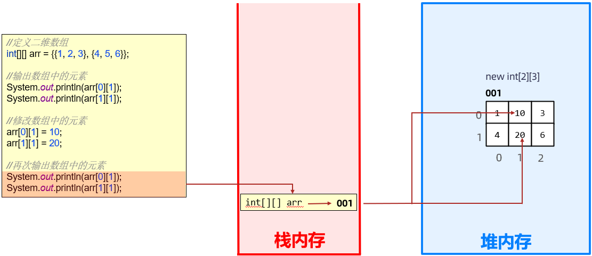

最后，我们自己编写代码验证一下：

```java
/*
    二维数组内存图代码
 */
public class ArrayTest {
    public static void main(String[] args) {
        //定义二维数组
        int[][] arr = {{1, 2, 3}, {4, 5, 6}};

        //输出数组中的元素
        System.out.println(arr[0][1]);
        System.out.println(arr[1][1]);

        //修改数组中的元素
        arr[0][1] = 10;
        arr[1][1] = 20;

        //再次输出数组中的元素
        System.out.println(arr[0][1]);
        System.out.println(arr[1][1]);
    }
}
```

由于仅仅是验证讲解的结论，故不需要练习。

### 案例

#### 案例5(二维数组常见操作之遍历)

来，继续啊，下面我们来学习二维数组常见操作：

这里我们讲解两个操作：

- 遍历
- 元素打乱

首先，我们来看二维数组遍历。

这里有一个需求：已知一个二维数组 arr = {{1,2,3},{4,5,6},{7,8,9}}; 请把元素在控制台输出。

看完需求之后，我们到IDEA中一起去实现一下，然后再回来总结：

```java
/*
    需求：已知一个二维数组 arr = {{1,2,3},{4,5,6},{7,8,9}}; 请把元素在控制台输出
 */
public class ArrayTest01 {
    public static void main(String[] args) {
        //定义二维数组，并进行静态初始化
        int[][] arr = {{1, 2, 3}, {4, 5, 6}, {7, 8, 9}};

        //获取数据1,2,3
//        System.out.println(arr[0][0]);
//        System.out.println(arr[0][1]);
//        System.out.println(arr[0][2]);
//        for (int i = 0; i < arr[0].length; i++) {
//            System.out.println(arr[0][i]);
//        }
//
//        //获取数据4,5,6
////        System.out.println(arr[1][0]);
////        System.out.println(arr[1][1]);
////        System.out.println(arr[1][2]);
//        for (int i = 0; i < arr[1].length; i++) {
//            System.out.println(arr[1][i]);
//        }
//
//        //获取数据7,8,9
////        System.out.println(arr[2][0]);
////        System.out.println(arr[2][1]);
////        System.out.println(arr[2][2]);
//        for (int i = 0; i < arr[2].length; i++) {
//            System.out.println(arr[2][i]);
//        }

        for (int i = 0; i < arr.length; i++) {
            //arr[i]
            for (int j = 0; j < arr[i].length; j++) {
                System.out.print(arr[i][j]+" ");
            }
            System.out.println();
        }
    }
}
```

在代码讲解过程中，我们讲解了循环嵌套：for循环的语句体是循环语句，这种现象被称为循环嵌套。

讲解完毕后，回到资料中我们去总结一下：

在实现的过程中，我们在二维数组中使用了循环嵌套：

① 循环嵌套：循环语句中嵌套循环语句

② 通过外层循环可以得到一维数组

③ 在通过内存循环可以得到每一个二维数组元素

好了，关于二维数组常见操作之遍历我们就先讲到这里。

讲解完毕后，大家赶快动手练习一下吧。

#### 案例6(二维数组常见操作之元素打乱)

来，继续啊，下面我们来学习二维数组中元素打乱。

在前面呢，我们讲解过一维数组中的元素打乱，这里的思路和前面是一样的，也是要随机产生二维数组中元素的索引，并进行元素交换。

只不过呢，二维数组元素的索引是两个值，所以，这里要产生两个随机数。

知道了二维数组元素打乱的基本思路后，下面我们到IDEA中去实现一下：

```java
import java.util.Random;

/*
    需求：已知二维数组 arr = {{1,2,3},{4,5,6},{7,8,9}};用程序实现把数组中的元素打乱,并在控制台输出打乱后的数组元素
 */
public class ArrayTest02 {
    public static void main(String[] args) {
        //定义二维数组，并进行静态初始化
        int[][] arr = {{1, 2, 3}, {4, 5, 6}, {7, 8, 9}};

        //创建随机数对象
        Random r = new Random();

        //遍历二维数组，进行元素打乱
        for (int i = 0; i < arr.length; i++) {
            for (int j = 0; j < arr[i].length; j++) {
                //arr[i][j]
                int x = r.nextInt(arr.length);
                int y = r.nextInt(arr[x].length);

                //元素交换
                int temp = arr[i][j];
                arr[i][j] = arr[x][y];
                arr[x][y] = temp;
            }
        }

        for (int i = 0; i < arr.length; i++) {
            for (int j = 0; j < arr[i].length; j++) {
                System.out.print(arr[i][j] + " ");
            }
            System.out.println();
        }
    }
}
```

好了，关于二维数组常见操作之元素打乱我们就先讲到这里

讲解完毕后，大家赶快动手练习一下吧。

#### 案例7(图片展示)

来，继续啊，下面我们来做一个案例图片展示。

关于图片展示呢？前面我们是学习过的，通过JLable组件就可以实现图片展示了。

看一下，我们这里的需求，我有很多小的图片，它们拼在一起就成了这样的一张美女美图。


下面我们要做的事情就是把这些图片一张张的给展示出来。

这里的窗体我们已经准备好了，我们要做的事情就是在窗体上显示这些图片。

下面我们到IDEA中去实现一下：

图片素材在今天的资料里面，复制到当前的模块目录下。

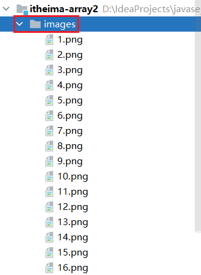

```java
import javax.swing.*;

/*
    图片展示
 */
public class ArrayTest03 {
    public static void main(String[] args) {
        //创建窗体对象
        JFrame jf = new JFrame();

        jf.setTitle("图片展示");
        jf.setSize(380, 400);
        jf.setDefaultCloseOperation(3);
        jf.setLocationRelativeTo(null);
        jf.setAlwaysOnTop(true);
        jf.setLayout(null);

//        JLabel jLabel1 = new JLabel(new ImageIcon("itheima-array2\\images\\1.png"));
//        jLabel1.setBounds(0, 0, 90, 90);
//        jf.add(jLabel1);
//
//        JLabel jLabel2 = new JLabel(new ImageIcon("itheima-array2\\images\\2.png"));
//        jLabel2.setBounds(90, 0, 90, 90);
//        jf.add(jLabel2);
//
//        JLabel jLabel3 = new JLabel(new ImageIcon("itheima-array2\\images\\3.png"));
//        jLabel3.setBounds(180, 0, 90, 90);
//        jf.add(jLabel3);
//
//        JLabel jLabel4 = new JLabel(new ImageIcon("itheima-array2\\images\\4.png"));
//        jLabel4.setBounds(270, 0, 90, 90);
//        jf.add(jLabel4);

//        for (int i=0; i<4; i++) {
//            JLabel jLabel = new JLabel(new ImageIcon("itheima-array2\\images\\"+(i+1)+".png"));
//            jLabel.setBounds(i*90,0,90,90);
//            jf.add(jLabel);
//        }
//
////        JLabel jLabel5 = new JLabel(new ImageIcon("itheima-array2\\images\\5.png"));
////        jLabel5.setBounds(0, 90, 90, 90);
////        jf.add(jLabel5);
////
////        JLabel jLabel6 = new JLabel(new ImageIcon("itheima-array2\\images\\6.png"));
////        jLabel6.setBounds(90, 90, 90, 90);
////        jf.add(jLabel6);
////
////        JLabel jLabel7 = new JLabel(new ImageIcon("itheima-array2\\images\\7.png"));
////        jLabel7.setBounds(180, 90, 90, 90);
////        jf.add(jLabel7);
////
////        JLabel jLabel8 = new JLabel(new ImageIcon("itheima-array2\\images\\8.png"));
////        jLabel8.setBounds(270, 90, 90, 90);
////        jf.add(jLabel8);
//        for (int i=0; i<4; i++) {
//            JLabel jLabel = new JLabel(new ImageIcon("itheima-array2\\images\\"+(i+5)+".png"));
//            jLabel.setBounds(i*90,90,90,90);
//            jf.add(jLabel);
//        }
//
////        JLabel jLabel9 = new JLabel(new ImageIcon("itheima-array2\\images\\9.png"));
////        jLabel9.setBounds(0, 180, 90, 90);
////        jf.add(jLabel9);
////
////        JLabel jLabel10 = new JLabel(new ImageIcon("itheima-array2\\images\\10.png"));
////        jLabel10.setBounds(90, 180, 90, 90);
////        jf.add(jLabel10);
////
////        JLabel jLabel11 = new JLabel(new ImageIcon("itheima-array2\\images\\11.png"));
////        jLabel11.setBounds(180, 180, 90, 90);
////        jf.add(jLabel11);
////
////        JLabel jLabel12 = new JLabel(new ImageIcon("itheima-array2\\images\\12.png"));
////        jLabel12.setBounds(270, 180, 90, 90);
////        jf.add(jLabel12);
//        for (int i=0; i<4; i++) {
//            JLabel jLabel = new JLabel(new ImageIcon("itheima-array2\\images\\"+(i+9)+".png"));
//            jLabel.setBounds(i*90,180,90,90);
//            jf.add(jLabel);
//        }
//
////        JLabel jLabel13 = new JLabel(new ImageIcon("itheima-array2\\images\\13.png"));
////        jLabel13.setBounds(0, 270, 90, 90);
////        jf.add(jLabel13);
////
////        JLabel jLabel14 = new JLabel(new ImageIcon("itheima-array2\\images\\14.png"));
////        jLabel14.setBounds(90, 270, 90, 90);
////        jf.add(jLabel14);
////
////        JLabel jLabel15 = new JLabel(new ImageIcon("itheima-array2\\images\\15.png"));
////        jLabel15.setBounds(180, 270, 90, 90);
////        jf.add(jLabel15);
////
////        JLabel jLabel16 = new JLabel(new ImageIcon("itheima-array2\\images\\16.png"));
////        jLabel16.setBounds(270, 270, 90, 90);
////        jf.add(jLabel16);
//        for (int i=0; i<4; i++) {
//            JLabel jLabel = new JLabel(new ImageIcon("itheima-array2\\images\\"+(i+13)+".png"));
//            jLabel.setBounds(i*90,270,90,90);
//            jf.add(jLabel);
//        }

        //定义图片编号的数组
        int[][] datas = {
                {1,2,3,4},
                {5,6,7,8},
                {9,10,11,12},
                {13,14,15,16}
        };

        for (int i = 0; i < datas.length; i++) {
            for (int j = 0; j < datas[i].length; j++) {
                //datas[i][j]
                JLabel jLabel = new JLabel(new ImageIcon("itheima-array2\\images\\"+datas[i][j]+".png"));
                jLabel.setBounds(j*90,i*90,90,90);
                jf.add(jLabel);
            }
        }

        jf.setVisible(true);
    }
}
```

在代码的讲解过程中，我们先一张张的展示图片，后面通过二维数组的方式改进了图片的存储，最终优化了图片展示。

好了，关于案例图片展示我们就先讲到这里

讲解完毕后，大家赶快动手练习一下吧。

#### 案例8(图片打乱)

来，继续啊，下面我们来做一个案例图片打乱。

刚才我们讲解了图片展示的案例，现在呢，要在图片展示的基础上，把图片打乱，我们可以看一下打乱后的效果，其实就是对二维数组中的图片的编号打乱，然后再显示出来就可以了。

下面呢，我们到IDEA中一起去实现一下：

```java
import javax.swing.*;
import java.util.Random;

/*
    图片打乱
 */
public class ArrayTest04 {
    public static void main(String[] args) {
        //创建窗体对象
        JFrame jf = new JFrame();

        jf.setTitle("图片打乱");
        jf.setSize(380, 400);
        jf.setDefaultCloseOperation(3);
        jf.setLocationRelativeTo(null);
        jf.setAlwaysOnTop(true);
        jf.setLayout(null);

        //图片打乱
        int[][] datas = {
                {1,2,3,4},
                {5,6,7,8},
                {9,10,11,12},
                {13,14,15,16}
        };

        Random r = new Random();
        for (int i = 0; i < datas.length; i++) {
            for (int j = 0; j < datas[i].length; j++) {
                int x = r.nextInt(datas.length);
                int y = r.nextInt(datas[x].length);

                int temp = datas[i][j];
                datas[i][j] = datas[x][y];
                datas[x][y] = temp;
            }
        }

        for (int i = 0; i < datas.length; i++) {
            for (int j = 0; j < datas[i].length; j++) {
                JLabel jLabel = new JLabel(new ImageIcon("itheima-array2\\images\\"+datas[i][j]+".png"));
                jLabel.setBounds(j*90,i*90,90,90);
                jf.add(jLabel);
            }
        }

        jf.setVisible(true);
    }
}
```

讲解完毕后，大家赶快动手练习一下吧。