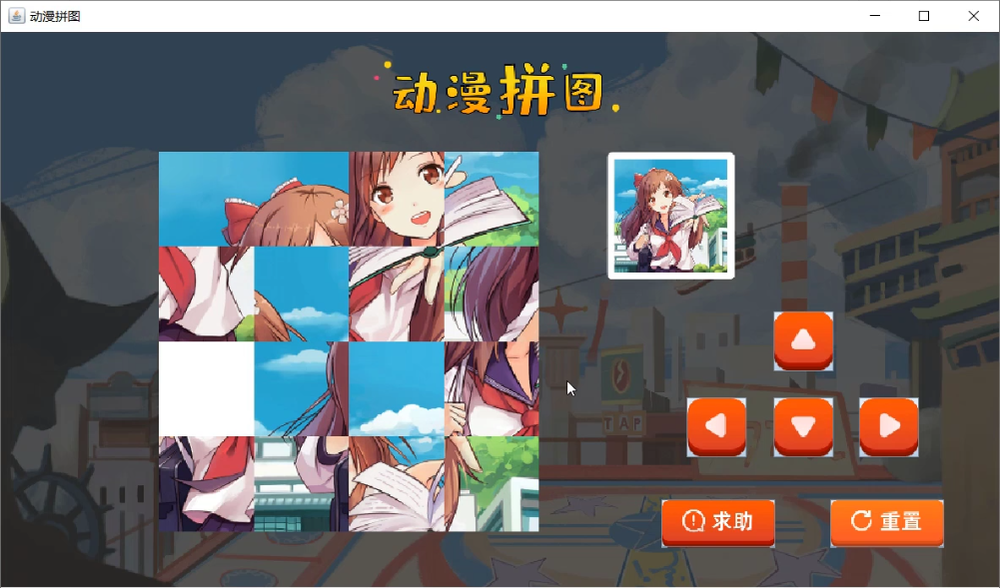

# 继承

## 继承概述

来，继续啊，为了讲解项目动漫拼图，这里我们先讲解一个小知识：继承概述。

通过这个名字呢，大家也发现了，这里我们仅仅是对继承做一个简单的讲解，后续呢，会深入的给大家再来讲解继承相关的知识。

首先，我们来说一下，什么是**继承：**

- 继承是面向对象三大特征之一(封装，继承和多态)
- 可以使得子类具有父类的属性和方法，还可以在子类中重新定义，追加属性和方法

也就是说，通过继承，可以把父类中能够被访问到的成员变量和成员方法拿过来直接使用。

了解了什么是继承后，我们在来说一下，继承是如何实现的。

那继承是如何实现的呢？我们一起来看一下**继承的格式：**

- 格式：public class 子类名 extends 父类名 { }
- 范例：public class Zi <font color='red'>**extends**</font> Fu { }
- Fu：是父类，也被称为基类、超类
- Zi：是子类，也被称为派生类

在这里，Zi类和Fu类，通过extends就产生了继承关系。这样呢，Zi类就可以使用Fu类中的成员了。

在这里，Fu这个类，被称为是父类，也被称为基类、超类，Zi这个类：是子类，也被称为派生类

了解了继承是如何实现的，下面呢，我们再来举例说明一下，其实我们在前面已经使用过继承的知识了。

看这里，我们使用过GUI中这样的几个组件：

JLabel，JButton，JTextField，JTextArea

并且还使用过它们的一些方法，比如说：public void setBounds(int x, int y, int width, int height)，这几个组件我们都使用过这样的一个方法。

大家想一下，如果我们在每个类中都定义这样的同体系的多个类中都使用的方法，有多个这样的组件，我们就要定义多少个这样的方法。

将来如果有新的组件，我们还是需要定义这样的方法，这样设计起来，我们程序的复用性是不是就太差了啊。

而且，这是Java给我们提供的API，Java大师们肯定不会有这么low的设计，

所以，为了提高代码的复用性，这里就采用了继承的思想，让一个类中定义这样的方法，所有继承该类的类就可以使用这个方法了。

来，打开帮助文档，我们一起去看一下：


其他的几个，大家打开文档自己去看，最终能够找到他们共同的父类：**Component**。

看完文档之后，回来总结一下，继承的好处之一是：**提高了代码的复用性**

在这里，我们提到了什么是继承，继承的格式及继承的好处。

好了，关于继承概述我们就先讲到这里。

### 继承的练习

来，继续啊，下面呢我们来做一个继承的练习。

首先，我们来看一下需求：使用继承的方式，改写用户登录界面展示的案例

知道了，要做什么之后，下面呢，我们到IDEA中一边分析，一边实现：

```java
import javax.swing.*;

public class UserLoginFrame extends JFrame {

    public UserLoginFrame() {
        //窗体初始化
        initFrame();

        //绘制窗体
        paintView();

        this.setVisible(true);
    }

    public void paintView() {
        //显示用户名文本
        JLabel usernameLable = new JLabel("用户名");
        usernameLable.setBounds(50, 50, 50, 20);
        this.add(usernameLable);

        //用户名输入框
        JTextField usernameField = new JTextField();
        usernameField.setBounds(150, 50, 180, 20);
        this.add(usernameField);

        //显示密码文本
        JLabel passwordLable = new JLabel("密码");
        passwordLable.setBounds(50, 100, 50, 20);
        this.add(passwordLable);

        //密码输入框
        JPasswordField passwordField = new JPasswordField();
        passwordField.setBounds(150, 100, 180, 20);
        this.add(passwordField);

        //登录按钮
        JButton loginButton = new JButton("登录");
        loginButton.setBounds(50, 200, 280, 20);
        this.add(loginButton);
    }

    public void initFrame() {
        this.setTitle("用户登录");
        this.setSize(400, 300);
        this.setDefaultCloseOperation(3);
        this.setLocationRelativeTo(null);
        this.setAlwaysOnTop(true);
        this.setLayout(null);
    }

}
```

```java
public class App {
    public static void main(String[] args) {
        UserLoginFrame userLoginFrame = new UserLoginFrame();
    }
}
```

用继承改进后，代码看起来清晰多了，所以，如果我们做GUI开发的，在做窗体的时候，就会定义类继承自JFrame来使用。

好了，关于继承的练习我们就先讲到这里。

## 动漫美女拼图

### 项目演示和课程安排

来，继续啊，通过前面所学知识，下面我们一起来实现动漫美女拼图这个项目。

为了让大家对这个项目有一定的了解，这里我们先来演示一下该项目：

来，打开准备好的Java文件，这里有两个类：


一个是动漫拼图窗体的类，一个是测试类。

右键运行测试类，我们看到了这样的一个界面。



大家可以通过按钮来玩这个游戏了。还可以点击求助按钮和重置按钮。

演示完动漫美女拼图项目，回来我们说一下这一块的课程安排：


首先，我们绘制游戏界面，把界面中要使用到的组件都给展示出来。

接着，我们讲解图片打乱，这样动漫拼图的界面就启动了。

然后，我们给按钮注册事件，这样我们就知道在哪里实现我们的功能了。

最后，我们来分别完成，移动业务，求助业务，重置业务，把整个项目给实现了

好了，动漫美女拼图项目的演示和课程安排我们就先讲到这里。

## 动漫美女拼图游戏实现

### 窗体绘制


**分析思路：**

1：新建一个模块：itheima-picture-puzzle；在模块的src下新建一个包com.itheima

2：在com.itheima这个包下定义类：PictureFrame，继承自JFrame

3：在PictureFrame类中编写无参构造方法，在构造方法中调用两个方法：

​	第一个方法：initFrame()，用于窗体的基本设置

​	第二个方法：setVisible(true)，用于设置窗体可见

4：在initFrame()方法中编写代码，进行窗体的基本设置

​	窗体大小

​	窗体标题

​	窗体居中

​	窗体关闭时退出应用程序

​	窗体位于其他窗口之上

​	取消窗体默认布局

5：在com.itheima包下定义测试类：App；创建PictureFrame的对象进行测试

**代码实现：**

```java
public class PictureFrame extends JFrame {
    public PictureFrame() {
        //用于窗体的基本设置
        initFrame();
        //设置窗体可见
        this.setVisible(true);
    }

    //用于窗体的基本设置
    public void initFrame() {
        //窗体大小
        this.setSize(960,565);
        //窗体标题
        this.setTitle("动漫拼图");
        //窗体居中
        this.setLocationRelativeTo(null);
        //窗体关闭时退出应用程序
        this.setDefaultCloseOperation(3);
        //窗体位于其他窗口之上
        this.setAlwaysOnTop(true);
        //取消窗体默认布局
        this.setLayout(null);
    }
}

```

```java
public class App {
    public static void main(String[] args) {
        PictureFrame pf = new PictureFrame();
    }
}

```

讲解完毕后，大家赶快动手练习一下吧。

### 窗体上组件绘制


**分析思路：**

1：定义方法，用于窗体上的组件绘制：paintView()

2：按照如下组件绘制

​	标题图片

​	面板图片，存储着将来要移动的图片

​	参照图

​	上按钮

​	左按钮

​	下按钮

​	右按钮

​	求助按钮

​	重置按钮

3：在构造方法中调用paintView()方法		

**代码实现：**

```java
	//窗体上组件的绘制
    public void paintView() {
        //标题图片
        JLabel titleLabel = new JLabel(new ImageIcon("itheima-picture-puzzle\\images\\title.png"));
        titleLabel.setBounds(354,27,232,57);
        this.add(titleLabel);

        //定义一个二维数组，用来存储图片的编号
        int[][] datas = {
                {1,2,3,4},
                {5,6,7,8},
                {9,10,11,12},
                {13,14,15,16}
        };

        //创建面板
        JPanel imagePanel = new JPanel();
        imagePanel.setBounds(150,114,360,360);
        imagePanel.setLayout(null);
        //遍历二维数组，得到图片编号
        for (int i = 0; i < datas.length; i++) {
            for (int j = 0; j < datas[i].length; j++) {
                //创建JLabel对象，加载图片资源
                JLabel imageLabel = new JLabel(new ImageIcon("itheima-picture-puzzle\\images\\"+datas[i][j]+".png"));
                //调整图片的位置
                imageLabel.setBounds(j*90,i*90,90,90);
                imagePanel.add(imageLabel);
            }
        }
        //把面板添加到窗体上
        this.add(imagePanel);

        //动漫参照图
        JLabel canZhaoTuLabel = new JLabel(new ImageIcon("itheima-picture-puzzle\\images\\canzhaotu.png"));
        canZhaoTuLabel.setBounds(574,114,122,121);
        this.add(canZhaoTuLabel);

        //上下左右，求助，重置按钮
        JButton shangButton = new JButton(new ImageIcon("itheima-picture-puzzle\\images\\shang.png"));
        shangButton.setBounds(732,265,57,57);
        this.add(shangButton);

        JButton zuoButton = new JButton(new ImageIcon("itheima-picture-puzzle\\images\\zuo.png"));
        zuoButton.setBounds(650,347,57,57);
        this.add(zuoButton);

        JButton xiaButton = new JButton(new ImageIcon("itheima-picture-puzzle\\images\\xia.png"));
        xiaButton.setBounds(732,347,57,57);
        this.add(xiaButton);

        JButton youButton = new JButton(new ImageIcon("itheima-picture-puzzle\\images\\you.png"));
        youButton.setBounds(813,347,57,57);
        this.add(youButton);

        JButton qiuZhuButton = new JButton(new ImageIcon("itheima-picture-puzzle\\images\\qiuzhu.png"));
        qiuZhuButton.setBounds(626,444,108,45);
        this.add(qiuZhuButton);

        JButton chongZhiButton = new JButton(new ImageIcon("itheima-picture-puzzle\\images\\chongzhi.png"));
        chongZhiButton.setBounds(786,444,108,45);
        this.add(chongZhiButton);

        //展示背景图
        JLabel backgroundLabel = new JLabel(new ImageIcon("itheima-picture-puzzle\\images\\background.png"));
        backgroundLabel.setBounds(0,0,960,530);
        this.add(backgroundLabel);
    }
```

```java
构造方法方法中调用绘图方法
	public PictureFrame() {
        //用于窗体的基本设置
        initFrame();
        //窗体上组件的绘制
        paintView();
        //设置窗体可见
        this.setVisible(true);
    }
```

讲解完毕后，大家赶快动手练习一下吧。

### 图片打乱


图片打乱，其实就是二维数组元素打乱。

**注意事项：**

- 由于在多个方法中使用同一个数组，故将二维数组的定义放置在成员位置
- 为了能够进行图片的移动，把16号图片用0号图片替换，当前15个移动到正确位置，显示正确的图片

**分析思路：**

1：定义方法，用于二维数组元素打乱：initData()

2：创建Random对象

3：遍历存储图片编号的二维数组，得到每一个元素

4：产生两个随机索引，进行二维数组元素交换

```
	int x = r.nextInt(datas.length);//行索引
    int y = r.nextInt(datas[x].length);//列索引

	//元素交换
    int temp = datas[i][j];
    datas[i][j] = datas[x][y];
    datas[x][y] = temp;
```

5：在构造方法中调用initData()方法

**代码实现：**

```java
private int[][] datas = {
        {1, 2, 3, 4},
        {5, 6, 7, 8},
        {9, 10, 11, 12},
        {13, 14, 15, 0}
};

```

```java
//二维数组元素打乱
public void randomData() {
    Random r = new Random();
    for (int i = 0; i < datas.length; i++) {
        for (int j = 0; j < datas[i].length; j++) {
            int x = r.nextInt(datas.length);
            int y = r.nextInt(datas[i].length);

            int temp = datas[i][j];
            datas[i][j] = datas[x][y];
            datas[x][y] = temp;
        }
    }
}

public PictureFrame() {
    //用于窗体的基本设置
    initFrame();
    //二维数组元素打乱
    randomData();
    //窗体上组件的绘制
    paintView();
    //设置窗体可见
    this.setVisible(true);
}
```

讲解完毕后，大家赶快动手练习一下吧。

### 纪录0号图片的索引

为什么要纪录0号图片索引呢？

- 由于将来要进行图片的移动，以实现动漫拼图的实现
- 而移动的操作，得有一个空白的区别，这里我们采用0号图片表示，需要纪录0号图片的位置，也就是在数组中的索引

**分析思路：**

1：在PictureFrame类中定义两个成员变量用于纪录0号图片的索引

​	private int x0;

​	private int y0;

2：在initData()方法中继续编写代码，在打乱后的数组中找到0号图片的位置

​	遍历二维数组，得到每一个元素

​	如果元素为0，则纪录该元素的索引，并结束循环。

**代码实现：**

```java
//定义两个int类型的变量，用于纪录0号图片的位置
private int x0;
private int y0;
```

```java
//二维数组元素打乱
public void randomData() {
    Random r = new Random();
    for (int i = 0; i < datas.length; i++) {
        for (int j = 0; j < datas[i].length; j++) {
            int x = r.nextInt(datas.length);
            int y = r.nextInt(datas[i].length);

            int temp = datas[i][j];
            datas[i][j] = datas[x][y];
            datas[x][y] = temp;
        }
    }

    //纪录0号图片的位置
    wc:for (int i = 0; i < datas.length; i++) {
        for (int j = 0; j < datas[i].length; j++) {
            if(datas[i][j] == 0) {
                x0 = i;
                y0 = j;
                break wc;
            }
        }
    }
    //System.out.println(x0+","+y0);
}
```

在代码讲解过程中，讲解了一个新知识，就是嵌套循环的退出。给循环起名字就可以实现退出指定的循环。

讲解完毕后，大家赶快动手练习一下吧。

### 给按钮注册事件

**注意事项：**由于在多个方法中使用同一个按钮，故将按钮的定义放置在成员位置

**分析思路：**

1：定义方法，用于给按钮添加事件：addButtonEvent()

2：在addButtonEvent()方法中给每一个按钮添加事件，并给出输出语句提示

3：在构造方法中调用addButtonEvent()方法

**代码实现：**

```java
//给按钮添加事件
public void addButtonEvent() {
    shangButton.addActionListener(new ActionListener() {
        @Override
        public void actionPerformed(ActionEvent e) {
            System.out.println("上");
        }
    });
    zuoButton.addActionListener(new ActionListener() {
        @Override
        public void actionPerformed(ActionEvent e) {
            System.out.println("左");
        }
    });
    xiaButton.addActionListener(new ActionListener() {
        @Override
        public void actionPerformed(ActionEvent e) {
            System.out.println("下");
        }
    });
    youButton.addActionListener(new ActionListener() {
        @Override
        public void actionPerformed(ActionEvent e) {
            System.out.println("右");
        }
    });
    qiuzhuButton.addActionListener(new ActionListener() {
        @Override
        public void actionPerformed(ActionEvent e) {
            System.out.println("求助");
        }
    });
    chongzhiButton.addActionListener(new ActionListener() {
        @Override
        public void actionPerformed(ActionEvent e) {
            System.out.println("重置");
        }
    });
}

```

```java
//无参构造方法
public PictureFrame() {
    //用于窗体的基本设置
    initFrame();
    //二维数组元素打乱
    randomData();
    //窗体上组件的绘制
    paintView();
    //给按钮添加事件
    addButtonEvent();
    //设置窗体可见
    this.setVisible(true);
}
```

讲解完毕后，大家赶快动手练习一下吧。

### 移动业务实现

**移动原理：**图片的移动，其实就是做元素的交换，也就是二维数组的元素改变了，然后进行图片重绘就可以了

#### 上移业务实现

**分析思路：**

1：移动规则：竖的是x，横的是y

​	空白图片，和下方元素(x0+1)，进行交换

2：把空白图片和下方图片的位置交换

​	datas[x0] [y0] = datas[x0 + 1] [y0];

​	datas[x0 + 1] [y0] = 0;

​	x0 = x0 + 1;

3：编写重绘方法：rePaintView()

​	先移除，再重新绘制

4：调用重绘方法

5：边界问题处理：当x0=3，不能进行上移动

**代码实现：**

```java
shangButton.addActionListener(new ActionListener() {
    @Override
    public void actionPerformed(ActionEvent e) {
        //边界处理
        if (x0 == 3) {
            return;
        }
        //位置交换
        datas[x0][y0] = datas[x0 + 1][y0];
        datas[x0 + 1][y0] = 0;
        x0 = x0 + 1;
        //重绘方法调用
        rePaintView();
    }
});

//移动的图形重新绘制
public void rePaintView() {
    //移除所有
    imagePanel.removeAll();

    //遍历二维数组，得到每一个图片编号
    for (int i = 0; i < datas.length; i++) {
        for (int j = 0; j < datas[i].length; j++) {
            //在遍历的过程中，创建 JLabel 对象，加载图片资源
            JLabel imageLabel = new JLabel(new ImageIcon("itheima-picture-puzzle\\images\\" + datas[i][j] + ".png"));
            //调整图片资源的摆放位置
            imageLabel.setBounds(j * 90, i * 90, 90, 90);
            imagePanel.add(imageLabel);
        }
    }

    //重新绘制窗体
    imagePanel.repaint();
}
```

讲解完毕后，大家赶快动手练习一下吧。

#### 其他移动业务实现

**分析思路：**

1：左移动

​	边界：y0=3

​	移动代码：

```
        datas[x0][y0] = datas[x0][y0 + 1];
        
        datas[x0][y0 + 1] = 0;
        
        y0 = y0 + 1;

```

2：下移动

​	边界：x0=0

​	移动代码：

```
        datas[x0][y0] = datas[x0 - 1][y0];
        
        datas[x0 - 1][y0] = 0;
        
        x0 = x0 - 1;

```

3：右移动

​	边界：y0=0

​	移动代码：

```
        datas[x0][y0] = datas[x0][y0 - 1];
        
        datas[x0][y0 - 1] = 0;
        
        y0 = y0 - 1;

```

**代码实现：**

```java
zuoButton.addActionListener(new ActionListener() {
    @Override
    public void actionPerformed(ActionEvent e) {
        if (y0 == 3) {
            return;
        }
        datas[x0][y0] = datas[x0][y0 + 1];
        datas[x0][y0 + 1] = 0;
        y0 = y0 + 1;
        rePaintView();
    }
});
xiaButton.addActionListener(new ActionListener() {
    @Override
    public void actionPerformed(ActionEvent e) {
        if (x0 == 0) {
            return;
        }
        datas[x0][y0] = datas[x0 - 1][y0];
        datas[x0 - 1][y0] = 0;
        x0 = x0 - 1;
        rePaintView();
    }
});
youButton.addActionListener(new ActionListener() {
    @Override
    public void actionPerformed(ActionEvent e) {
        if (y0 == 0) {
            return;
        }
        datas[x0][y0] = datas[x0][y0 - 1];
        datas[x0][y0 - 1] = 0;
        y0 = y0 - 1;
        rePaintView();
    }
});
```

讲解完毕后，大家赶快动手练习一下吧。

### 求助业务实现


**注意事项：**

- 数组元素应该是1-16，而不是0-15了
- 按钮也不能在点击了

**分析思路：**

1：定义移动成功的方法：success()

2：在success()方法内部进行如下操作：

​	修改datas数组的元素为正确的元素值

​	按钮设置为不可用

3：在重置操作中调用两个方法：

​	第一个方法：success()

​	第二个方法：rePaintView()

**代码实现：**

```java
//移动成功的操作
public void success() {
    datas = new int[][]{
            {1, 2, 3, 4},
            {5, 6, 7, 8},
            {9, 10, 11, 12},
            {13, 14, 15, 16}
    };
    shangButton.setEnabled(false);
    zuoButton.setEnabled(false);
    xiaButton.setEnabled(false);
    youButton.setEnabled(false);
}

```

```java
qiuzhuButton.addActionListener(new ActionListener() {
    @Override
    public void actionPerformed(ActionEvent e) {
        success();
        rePaintView();
    }
});
```

讲解完毕后，大家赶快动手练习一下吧。

### 移动业务的问题

**问题分析：**每次移动之后，都要判断是否移动成功，如果成功了，需要调用成功的方法。

而判断移动是否成功，我们来写方法实现。

**分析思路：**

1：定义一个方法，用于比较两个数组元素是否相同

2：每次移动完毕，调用该方法：

​	如果返回值为true，则调用success()方法

**代码实现：**

```java
//定义移动成功后的数组
private int[][] winDatas = {
    {1, 2, 3, 4},
    {5, 6, 7, 8},
    {9, 10, 11, 12},
    {13, 14, 15, 0}
};


```

```java
//判断移动是否成功
public boolean isSuccess() {
    for (int i = 0; i < datas.length; i++) {
        for (int j = 0; j < datas[i].length; j++) {
            if (datas[i][j] != winDatas[i][j]) {
                return false;
            }
        }
    }
    return true;
}

shangButton.addActionListener(new ActionListener() {
    @Override
    public void actionPerformed(ActionEvent e) {
        //边界处理
        if (x0 == 3) {
            return;
        }

        //位置交换
        datas[x0][y0] = datas[x0 + 1][y0];
        datas[x0 + 1][y0] = 0;
        x0 = x0 + 1;

        //判断移动是否成功
        if(isSuccess()) {
            success();
        }

        //调用重绘的方法
        rePaintView();
    }
});
zuoButton.addActionListener(new ActionListener() {
    @Override
    public void actionPerformed(ActionEvent e) {
        //边界处理
        if (y0 == 3) {
            return;
        }

        //位置交换
        datas[x0][y0] = datas[x0][y0 + 1];
        datas[x0][y0 + 1] = 0;
        y0 = y0 + 1;

        //判断移动是否成功
        if(isSuccess()) {
            success();
        }

        //调用重绘的方法
        rePaintView();
    }
});
xiaButton.addActionListener(new ActionListener() {
    @Override
    public void actionPerformed(ActionEvent e) {
        //边界处理
        if (x0 == 0) {
            return;
        }

        //位置交换
        datas[x0][y0] = datas[x0 - 1][y0];
        datas[x0 - 1][y0] = 0;
        x0 = x0 - 1;

        //判断移动是否成功
        if(isSuccess()) {
            success();
        }

        //调用重绘的方法
        rePaintView();

    }
});
youButton.addActionListener(new ActionListener() {
    @Override
    public void actionPerformed(ActionEvent e) {
        //边界处理
        if (y0 == 0) {
            return;
        }

        //位置交换
        datas[x0][y0] = datas[x0][y0 - 1];
        datas[x0][y0 - 1] = 0;
        y0 = y0 - 1;

        //判断移动是否成功
        if(isSuccess()) {
            success();
        }

        //调用重绘的方法
        rePaintView();
    }
});
```

讲解完毕后，大家赶快动手练习一下吧。

### 重置业务实现


**分析思路：**

1：当重置的时候，需要修改数组为1,2...15,0

2：打乱数组元素

3：重绘面板图

4：设置按钮可用

**代码实现：**

```java
chongzhiButton.addActionListener(new ActionListener() {
    @Override
    public void actionPerformed(ActionEvent e) {
        datas = new int[][]{
                {1, 2, 3, 4},
                {5, 6, 7, 8},
                {9, 10, 11, 12},
                {13, 14, 15, 0}
        };
        initData();
        rePaintView();
        shangButton.setEnabled(true);
        zuoButton.setEnabled(true);
        xiaButton.setEnabled(true);
        youButton.setEnabled(true);
    }
});
```

讲解完毕后，大家赶快动手练习一下吧。